# Architecture

Public API, workflow order, locked stack, and module ownership are governed by [CONTRACT.md](CONTRACT.md). This document describes the implementation inside those boundaries.

## System Flow

The production delivery path is `UltimateVideoV2` plus the `skill-showcase` scene family:

```text
brief.json + script-pack.json + asset-pack.json
  -> scripts/lib/script-project-generator.mjs
  -> caption semantic intent
  -> beat + lens + shot
  -> production component resolver
  -> Project JSON + Visual Plan
  -> src/project/projectSchema.ts
  -> src/project/compileProject.ts (derive render states from Visual Plan)
  -> src/project/sceneRegistry.tsx
  -> UltimateVideoV2
  -> Still / MP4 / Verify
```



```mermaid
flowchart LR
  classDef input fill:#eef7ff,stroke:#5a8dee,color:#102033,stroke-width:1px
  classDef orchestration fill:#f3f0ff,stroke:#8067d8,color:#18142e,stroke-width:1px
  classDef audio fill:#fff6e8,stroke:#d69a3d,color:#2b1d08,stroke-width:1px
  classDef project fill:#edf8f3,stroke:#47a878,color:#0d261b,stroke-width:1px
  classDef render fill:#f0f7f9,stroke:#3e9fb5,color:#09232a,stroke-width:1px
  classDef qa fill:#f8f9fc,stroke:#7f8da3,color:#172033,stroke-width:1px
  classDef fail fill:#fff0f0,stroke:#d45b5b,color:#3a1010,stroke-width:1.5px

  subgraph laneInput["内容输入 / Content Input"]
    direction TB
    pack["生产包 / Production Pack<br/>brief.json + script-pack.json + asset-pack.json"]
    script["口播真源 / Source Narration<br/>script-pack.spokenScript"]
    assets["素材登记 / Asset Registry<br/>audio + image + video + data"]
  end

  subgraph laneStudio["编排入口 / Orchestration Entry"]
    direction TB
    studio["Studio 或 CLI / Studio or CLI<br/>build-check or project:from-pack"]
    draft["初版项目 / Draft Project<br/>--ignore-captions"]
    voice["配音来源 / Voice Source<br/>TTS or uploaded audio"]
  end

  subgraph laneAudio["音频时间 / Audio Timing"]
    direction TB
    tts["语音资产 / Voice Asset<br/>tts:project or upload"]
    align["字幕对齐 / Caption Alignment<br/>audio:align-captions"]
    captions["时间字幕 / Timed Captions<br/>captions.json"]
  end

  subgraph laneProject["项目生成 / Project Generation"]
    direction TB
    rebuild["重建项目 / Rebuild Project<br/>project:from-pack --captions"]
    plan["视觉计划 / Visual Plan<br/>intent + beat + lens + shot"]
    compile["编译渲染态 / Compile Render State<br/>compileProject + sceneRegistry"]
  end

  subgraph laneRender["渲染输出 / Render Output"]
    direction TB
    stills["场景静帧 / Scene Stills<br/>project:scene-stills"]
    mp4["视频渲染 / MP4 Render<br/>project:render"]
  end

  subgraph laneQA["质检交付 / QA & Delivery"]
    direction TB
    check["结构质检 / Project Check<br/>project:check"]
    visual["视觉合同 / Visual Contract<br/>project:visual-check"]
    review["人工审片 / Human Review<br/>stills + motion + evidence"]
    verify["交付验证 / Delivery Verify<br/>project:verify"]
    deliver["交付就绪 / Delivery Ready<br/>download allowed"]
    fixContent["内容回修 / Content Revision<br/>script + style + assets"]
    fixRender["渲染诊断 / Render Diagnosis<br/>renderer + environment"]
  end

  pack --> studio
  script --> pack
  assets --> pack
  studio --> draft --> voice --> tts --> align --> captions --> rebuild
  rebuild --> plan --> check
  check -- "通过 / pass" --> visual
  visual -- "通过 / pass" --> compile
  compile --> stills --> review
  review -- "通过 / pass" --> mp4 --> verify
  verify -- "通过 / pass" --> deliver

  check -- "失败 / fail" --> fixContent --> pack
  visual -- "失败 / fail" --> fixContent
  review -- "失败 / fail" --> fixContent
  mp4 -- "失败 / fail" --> fixRender --> compile
  verify -- "失败 / fail" --> fixRender

  class pack,script,assets input
  class studio,draft,voice orchestration
  class tts,align,captions audio
  class rebuild,plan,compile project
  class stills,mp4 render
  class check,visual,review,verify,deliver qa
  class fixContent,fixRender fail
```

The Studio uses the same generator and renderer as command-line production. It does not maintain a second schema, renderer, or output path.

The repository also includes a non-public product-spec QA path. It is intentionally separate from the public Studio contract:

```text
video-product.json
  -> src/video-system/productSchema.ts
  -> scripts/lib/video-product-metrics.mjs
  -> scripts/lib/video-product-report.mjs
  -> src/compositions/product-system/VideoProductSystemDemo.tsx
```

This v2 path validates product-level narrative structure, visual variants, motion presets, and non-render reports. It does not change HTTP routes, Studio DTOs, workflow gates, or the `Project JSON -> UltimateVideoV2` delivery path.

## Production Pack Workflow

The `build-check` workflow is owned by `scripts/lib/studio-backend.mjs`:

```text
project:from-pack --ignore-captions
  -> tts:project
  -> audio:align-captions
  -> project:from-pack --captions captions.json
  -> project:check
```

`build-check-audio` uses uploaded audio and omits TTS. Both paths rebuild Project JSON after audio alignment. Source narration supplies semantic text; the current voiceover supplies timestamps.

## Runtime Ownership

| Responsibility | Owner |
|---|---|
| HTTP routes and response serialization | `remotion-video/scripts/tools-studio-server.mjs` |
| Jobs, state, fingerprints, persistence | `remotion-video/scripts/lib/studio-backend.mjs` |
| Production-pack generation | `remotion-video/scripts/build-project-from-production.mjs` |
| TTS and voice asset registration | `remotion-video/scripts/generate-tts-for-project.mjs` |
| Audio-derived caption timing | `remotion-video/scripts/align-captions-from-audio.mjs` |
| Frontend HTTP boundary | `remotion-video/src/tools/console/api.ts` |
| Frontend DTO mirrors | `remotion-video/src/tools/console/types.ts` |
| Navigation and invalidation | `remotion-video/src/tools/console/workflow-model.ts` |
| Studio orchestration | `remotion-video/src/tools/console/StudioApp.tsx` |
| Shell layout | `remotion-video/src/tools/console/StudioShell.tsx` |
| Project schema | `remotion-video/src/project/projectSchema.ts` |
| Compile-time timing and assets | `remotion-video/src/project/compileProject.ts` |
| Scene payload validation | `remotion-video/src/project/sceneRegistry.tsx` |
| Visual production checks | `remotion-video/scripts/lib/visual-contract.mjs` |
| Semantic intent and component selection | `remotion-video/scripts/lib/semantic-component-resolver.mjs` |
| Type-safe Visual Plan | `remotion-video/src/project/visualPlan.ts` |
| Production component descriptors and renderers | `productionComponentCatalog.json` + `HeroTrackV2.tsx` |

## Timeline Model

`scenes[].durationInFrames` is the render-duration source. Generated projects bind the following data to one timeline:

```text
audio timestamp
  -> captions[]
  -> scene.captionRange
  -> visualPlan.entries[]
     -> semantic intent
     -> beat + HeroLens + HeroShot
     -> production component + props + assets + diagnostics
  -> compileProject derives beats[] + heroTrack.states[]
```

For a multi-caption scene, `visualPlan.entries[]` must cover the complete caption range and scene duration. The narration hash binds the plan to the current caption text and timestamps. `compileProject` derives both semantic beats and Hero states from those entries, so stale payload state cannot outrank the plan.

## Asset And Evidence Flow

`asset-pack.json` is the only production-pack entry point for external files. `build-project-from-production.mjs` copies registered assets into `project.assets`, and `compileProject.ts` resolves scene `assetIds[]` against `remotion-video/public/` or `https://` URLs.

Current examples intentionally rely on procedural evidence surfaces: text, icons, generated panels, editor frames, terminal frames, and diagrams. The bundled example `asset-pack.json` contains no image or video entries, so evidence scenes that semantically resemble screenshots or media do not currently have real screenshot/image/video files attached. That is acceptable for structural tests, but not for a real media-backed delivery.

For media-backed production, every evidence scene that claims `screenshot`, `image`, `video`, `product`, `media-compare`, `asset-library`, `browser-demo`, `interface-audit`, `product-showcase`, `article-illustration`, `video-agent`, or `evidence-replay` evidence should reference at least one usable `image` or `video` asset. Missing media is a content-pack issue; the renderer must not invent a fake external screenshot and call it a real asset.

## Render Path

The only production scene family is `skill-showcase`:

```text
sceneRegistry.tsx
  -> SkillShowcase.tsx
     -> PortraitCinematicSkillShowcase.tsx
     -> HeroTrackV2.tsx
        -> production component registry
        -> matched Remotion renderer
```

The portrait composition has three independent responsibilities:

| Zone | Responsibility | Primary data |
|---|---|---|
| Top Hero | operation evidence and technical process | `heroTrack.states[].shot` |
| Middle-lower beat | current conclusion and emphasis | `beats[]` |
| Bottom captions | complete narration text | `captions[]` |

## Storyboard Contract

The project Storyboard is not `RemotionStoryboardLibrary`. The latter is a fixed capability acceptance catalog for renderer development. The Studio Storyboard reads `project.visualPlan.entries[]` and displays stills rendered from the current Project JSON. If a current still does not exist, it displays plan metadata and diagnostics rather than a hand-built wireframe.

```text
Project Visual Plan
  -> Storyboard inspector + project scene stills
  -> compileProject + UltimateVideoV2 + MP4
```

There is no Storyboard-only component resolver, renderer, or component override. `sceneEditor.componentId` remains provenance metadata and never changes the plan or render path.

## Component Catalog

Production and internal surfaces maintain a single component catalog: 29 production composition templates registered in `HeroTrackV2.tsx`.

```text
captionIndex
  -> intent (text semantic classification)
  -> lens (what this shot tells)
  -> shot (top evidence, composition requirements, motion requirements)
  -> componentId (one of 29 composition templates)
  -> Hero / beat / subtitle 3-layer sync
```

`intent`, `lens`, and `shot` are generation and matching data, not an alternative component library. `componentId` is the sole production identifier a component can preview, report, audit, and display in the Studio; its value is one of the 29 composition template IDs. The Studio public DTO maps this field to `compositionId` locally (see CONTRACT.md); there is no separate `compositionId` schema field.

| Layer | Responsibility | Driving data | Prohibited |
|---|---|---|---|
| Top Hero | operation evidence and technical process | shot.environment, shot.target, shot.evidence, assetIds, componentId | large keyword posters, irrelevant mock screenshots |
| Middle-lower beat | current conclusion, keyword, judgment, or count | beat.keyword/detail/value/evidence | duplicating Hero expression, encroaching on subtitle safe zone |
| Bottom captions | complete narration text | current caption text and timestamps | truncated narration, desynchronized switching |

The production catalog lists 29 composition templates, each with an independent spatial structure, primary focus, and motion mechanism. `generic-explainer` is excluded: it duplicates `concept-explainer` and is either removed or unreachable.

The production fallback is an explicit red diagnostic surface. `compileProject` and the visual contract reject fallback/error entries before a final render, so it cannot silently dominate an MP4.

Domain definitions live in [docs/INTRO.zh-CN.md](docs/INTRO.zh-CN.md). Production prohibitions live in [docs/PRODUCTION-GUARDRAILS.zh-CN.md](docs/PRODUCTION-GUARDRAILS.zh-CN.md).

## Renderer Quality Boundary

The production registry contains 29 composition template IDs. Registry reachability is not visual acceptance. A renderer must express the semantics of its `shot.kind` through composition and motion, not only copy, color, or icon changes.

`TechnicalShotHero`, `TrackShell`, and `ShotFrame` remain as compatibility and diagnostic surfaces. Matched production states now resolve to dedicated renderers for browser viewports, terminal execution, editor diffs, config inspection, interface audit, flow trace, test report, asset grids, system maps, before/after comparison, metric emphasis, editorial concept explanation, product showcase, editor canvas, article illustration, timeline story, quote callout, checklist progress, radial explainer, media compare, overview matrix, rule compare, code render, slide editor, article map, video agent, design compare, system summary, and evidence replay.

The root cause fixed in the current implementation was that all production descriptors could resolve while still sharing the same generic technical shell. The renderer boundary is therefore:

```text
visualPlan.entries[].componentId
  -> production component registry (29 composition templates)
  -> renderer compatible with entry.shot.kind
  -> semantic composition and motion
```

Current limitations:

- `asset-library` renders structured, generated thumbnail states from available shot evidence; it does not yet ingest arbitrary user media thumbnails from a full DAM.
- `concept-explainer` uses semantic text heuristics to vary editorial layouts; it is not a general design system generator.
- `code-diff` and `config-check` use editor/config semantics, but they do not parse real repository diffs unless the shot provides that data.
- Visual checks verify contract and fallback safety; human review of Still, QA contact sheets, and MP4 remains required for visual quality.

## Visual Taxonomy

- All 29 composition templates share a single registry in `HeroTrackV2.tsx`.
- `intent` / `lens` / `shot` are generation and matching data bound to `captionIndex`, not a second component library.
- `componentId` is the sole visual-orientation, previewable, auditable component identifier (mapped to `compositionId` only inside the Studio DTO).
- `captionIndex` is the sole time driver: Hero, beat, and subtitle at the same index must synchronize; no bypass state is allowed.

## Extension Points

| Change | Required integration points |
|---|---|
| Composition template | types, Zod schema, registry/catalog renderer, productionComponentCatalog.json, visual contract, tests, preview fixture, docs |
| Hero shot kind | `HeroShotKind`, Zod schema, semantic resolver routing, `TechnicalShotHero` fallback, visual contract, tests, docs |
| Public Studio DTO | `CONTRACT.md`, server serializer, `api.ts`, `types.ts`, provider and consumer tests |
| Workflow gate | `workflow-model.ts`, its tests, `CONTRACT.md`, affected UI tests |

Every composition template must have an independent spatial structure, primary focus, and motion mechanism. Consecutive use is capped at 2 caption entries per template. No fallback or error surface may enter production rendering.
