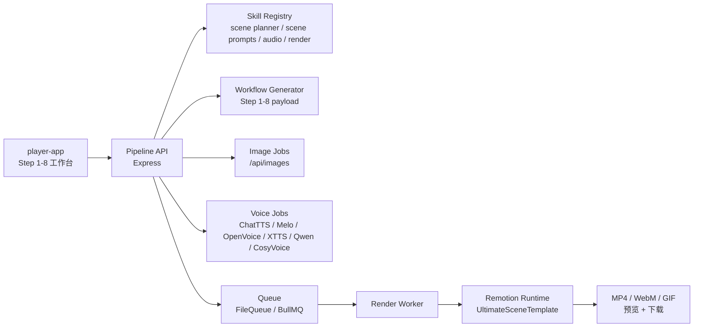

# OpenClaw Remotion Video Pipeline Architecture

> 更新：2026-04-25

当前仓库的主运行链路已经统一为 Ultimate 横版场景系统。Step 4 / 5 不再使用 `video-pipeline-storyboard` 固定 6 镜头合同，而是改为可变场景数的 `scene planner + scene prompts`。

## 1. 工程分层

| 层 | 目录 | 职责 |
| --- | --- | --- |
| 前端工作台 | `video-pipeline-view/player-app` | Step 1-8 UI、localStorage 持久化、任务轮询、结果确认 |
| API / Worker | `remotion-video/server` | Workflow、Skill catalog、图片任务、配音任务、渲染任务 |
| Remotion 运行时 | `remotion-video/src` | `UltimateSceneTemplate`、`OpenClawVideo`、动态 render plan |
| 运行时素材 | `remotion-video/src/assets` | 图标、视觉素材、运行时资源 |
| 文档 / 审计 | `remotion-video/docs` | 20 模板表、风格命中表、主链路说明 |

## 2. 总体链路

## 3. Step 1-8 职责

| Step | 名称 | 真源 Skill | 当前职责 |
| --- | --- | --- | --- |
| 1 | 逻辑分析 | `video-pipeline-analysis` | 搜索、事实提炼、分析骨架 |
| 2 | 标题生成 | `video-pipeline-title` | 多角度标题池、入选标题 |
| 3 | 内容生成 | `video-pipeline-content` | Hook / Body / CTA、目标口播时长、去 AI 味控制 |
| 4 | 场景编排 | `video-pipeline-scene-planner` | 生成 `6-12` 个横版场景，预分配 `sceneFamily` 与 `templateCandidates` |
| 5 | 视觉提示词 | `video-pipeline-scene-prompts` | 为每个场景生成 `16:9 / 1920x1080` 的视觉提示词与图片任务字段 |
| 6 | 配音脚本 | `video-pipeline-audio` | 中文音色配置、逐场景脚本、时长统计、TTS 提交 |
| 7 | Remotion 项目生成 | `remotion-video-maker` | 复用现有工程、composition、buildStatus、renderCommand |
| 8 | 渲染设置 | `video-pipeline-video` | 默认 `ultimate` 模板、最终参数、预览与导出 |

## 4. Skill 真源层

后端通过 `remotion-video/server/workflow/skillRegistry.js` 显式注册 Skill，并把每个 Skill 归一化成统一 `SkillSpec`。

固定映射：

- Step 1：`video-pipeline-analysis`
- Step 2：`video-pipeline-title`
- Step 3：`video-pipeline-content`
- Step 4：`video-pipeline-scene-planner`
- Step 5：`video-pipeline-scene-prompts`
- Step 6：`video-pipeline-audio`
- Step 7：`remotion-video-maker`
- Step 8：`video-pipeline-video`
- 主控：`video-pipeline-master`
- 质检：`video-pipeline-eval`

Step 4 / 5 的 skill source 不再依赖用户本机 `~/.openclaw` 里的旧文件，而是直接指向仓库内文档：

- `remotion-video/docs/workflow-skills/video-pipeline-scene-planner.SKILL.md`
- `remotion-video/docs/workflow-skills/video-pipeline-scene-prompts.SKILL.md`

## 5. 20 模板系统

当前主链路使用 `Ultimate 20` 模板 family：

- `hero`
- `feature-rail`
- `focus`
- `step-flow`
- `timeline`
- `compare-board`
- `number-strip`
- `terminal`
- `evidence-wall`
- `tag-matrix`
- `code`
- `architecture-map`
- `metrics`
- `data-stream`
- `memory-graph`
- `pipeline-flow`
- `benchmark-chart`
- `quote-highlight`
- `glossary-term`
- `cta`

硬规则：

- 第一屏固定 `hero`
- 最后一屏固定 `cta`
- 中段场景优先保持 family 多样性
- Step 5 默认输出 `16:9 / 1920x1080`

详细说明见：

- [remotion-video/docs/ultimate-20-template-audit.zh-CN.md](/Users/macos/OpenClaw/remotion-generated-video-project/remotion-video/docs/ultimate-20-template-audit.zh-CN.md)
- [remotion-video/docs/ultimate-20-template-cheatsheet.zh-CN.md](/Users/macos/OpenClaw/remotion-generated-video-project/remotion-video/docs/ultimate-20-template-cheatsheet.zh-CN.md)

## 6. 关键数据合同

Step 4 输出重点：

- `shots[]`
- `shots[].sceneFamily`
- `shots[].templateCandidates`
- `scenePlan`
- `templateCatalog`

Step 5 输出重点：

- `prompts.byShotId`
- `prompts.byShotId[].sceneFamily`
- `prompts.byShotId[].prompt`
- `prompts.byShotId[].promptZh`
- `prompts.byShotId[].canvasRatio`
- `prompts.byShotId[].canvasWidth`
- `prompts.byShotId[].canvasHeight`

编译到 Ultimate 时：

- `run-search-to-ultimate.mjs` 会继续保留 `family / sceneFamily / templateCandidates`
- `ultimate-project-adapter.js` 根据这些字段和内容语义生成最终 scenes

## 7. API 面

核心接口：

- `GET /health`
- `GET /api/skills/catalog`
- `GET /api/skills/:skillId`
- `POST /api/workflow/generate`
- `GET /api/workflow/:jobId`
- `POST /api/images/generate`
- `GET /api/images/:jobId`
- `POST /api/voice`
- `GET /api/voice/:jobId`
- `POST /api/render`
- `GET /api/render/:jobId`
- `GET /api/render/:jobId/download`

管理面补充：

- `GET /api/render`
- `GET /api/jobs`
- `GET /api/projects`
- `GET /api/projects/:project/assets`
- `DELETE /api/render/:jobId`
- `POST /api/render/:jobId/retry`
- `POST /api/voice/:jobId/retry`

## 8. 默认发布出口

- 默认 Composition：`UltimateSceneTemplate`
- 默认 build / preview 脚本：`remotion-video/package.json`
- 默认横版参数：`1920x1080 / 30fps`
- 图片回退 SVG 也已切到横版

仓库里仍保留部分历史组合代码作为存量资产，但它们不再是主线工作流的默认出口。

## 9. 发布校验

对外公开的主校验脚本：

- `npm run clean`
- `npm run test`
- `npm run typecheck`
- `npm run build`
- `npm run build:video`
- `npm run release:check`

其中 `release:check` 会执行：

- 运行产物清理
- 后端测试
- 前端 typecheck
- Remotion typecheck
- 后端关键文件 `node --check`
- 前端 build
- 运行目录清洁检查
