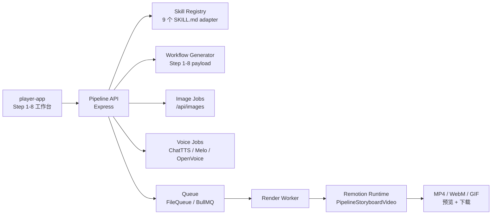

# OpenClaw Remotion Video Pipeline Architecture

> 更新：2026-04-11

当前仓库已经收成独立发布形态：前端工作台负责 Step 1-8 编排，`remotion-video` 负责 Skill 解析、工作流生成、配音、图片、项目构建和渲染导出；仓库根只保留当前主链路与少量升级归档。

## 1. 工程分层

| 层 | 目录 | 职责 |
|---|---|---|
| 前端工作台 | `video-pipeline-view/player-app` | Step 1-8 UI、localStorage 持久化、任务轮询、结果确认 |
| API / Worker | `remotion-video/server` | Workflow、Skill catalog、图片任务、配音任务、渲染任务 |
| Remotion 运行时 | `remotion-video/src` | 组合、字幕、镜头渲染、动态 render plan |
| 运行时素材 | `remotion-video/src/assets` | Remotion 运行时实际使用的图标和视觉资源 |
| 升级归档 | `docs/archive/` | 少量保留的升级计划文档，不参与 CI 和运行链路 |

## 2. 总体链路

## 3. Step 1-8 职责

| Step | 名称 | 真源 Skill | 当前职责 |
|---|---|---|---|
| 1 | 逻辑分析 | `video-pipeline-analysis` | 标题相关检索、事实提炼、分析骨架 |
| 2 | 标题生成 | `video-pipeline-title` | 标题策略、多角度标题池、入选标题 |
| 3 | 内容生成 | `video-pipeline-content` | Hook / Body / CTA、目标口播时长、去 AI 味控制 |
| 4 | 分镜结构 | `video-pipeline-storyboard` | 固定 6 镜头结构、时长与层级 |
| 5 | 分镜图提示词 | `video-pipeline-storyboard` | 每镜视觉语义、中文提示词、图片任务状态 |
| 6 | 配音脚本 | `video-pipeline-audio` | 中文音色配置、逐镜脚本、时长统计、TTS 提交 |
| 7 | Remotion 项目生成 | `remotion-video-maker` | 复用现有工程、composition、buildStatus、renderCommand |
| 8 | 渲染设置 | `video-pipeline-video` | 模板、格式、质量、预览与下载导出 |

## 4. Skill 真源层

后端通过 `remotion-video/server/workflow/skillRegistry.js` 显式注册 9 个已知 Skill，而不是做通用 Markdown 猜测解析。

固定映射：

- Step 1：`video-pipeline-analysis`
- Step 2：`video-pipeline-title`
- Step 3：`video-pipeline-content`
- Step 4 / 5：`video-pipeline-storyboard`
- Step 6：`video-pipeline-audio`
- Step 7：`remotion-video-maker`
- Step 8：`video-pipeline-video`
- 主控：`video-pipeline-master`
- 质检：`video-pipeline-eval`

每个 Skill 会被归一化成统一 `SkillSpec`，供以下位置复用：

- `GET /api/skills/catalog`
- `GET /api/skills/:skillId`
- `POST /api/workflow/generate`
- 右侧“当前 Step 作战台”

## 5. 当前生成策略

### Step 1-3

- 已改成快响应链路
- 生成前先读当前 Step Skill 覆盖层
- Step 1 真实使用标题关键词与检索结果
- Step 2 依赖已确认的 Step 1
- Step 3 依赖已确认标题，并支持：
  - 目标口播时长
  - 自动折算常规口播字数
  - 去 AI 味强度
  - 拟人口播人设

### Step 4-5

- 以固定 6 镜头结构为主线
- Step 4 负责镜头结构
- Step 5 负责中文视觉描述与图片任务
- 图片任务通过 `/api/images/generate` 提交，`/api/images/:jobId` 轮询

### Step 6

- 默认引擎：`ChatTTS`
- 回退顺序：`ChatTTS -> Melo -> OpenVoice`
- 后端真实读取前端中文配置，不再只看旧 preset 文本

### Step 7-8

- Step 7 只负责项目构建摘要，不自动渲染
- Step 8 只负责最终渲染参数、播放、下载
- 渲染时直接消费当前 Step 4 / 5 / 6 的真实结果，而不是写死旧分镜

## 6. API 面

核心接口如下：

- `GET /health`
- `GET /api/skills/catalog`
- `GET /api/skills/:skillId`
- `POST /api/workflow/generate`
- `POST /api/images/generate`
- `GET /api/images/:jobId`
- `POST /api/voice`
- `GET /api/voice/:jobId`
- `POST /api/render`
- `GET /api/render/:jobId`
- `GET /api/render/:jobId/download`

## 7. 持久化与产物

前端：

- `pipelineState`
- Step 级编辑草稿
- 当前任务状态与最近渲染结果

后端运行时产物：

- `remotion-video/public/assets/`
- `remotion-video/public/jobs/`
- `remotion-video/public/voice/`

这些目录现在视为本地产物，不再属于发布面的一部分，已由根目录 `.gitignore` 屏蔽。

## 8. 发布校验

当前仓库对外只保留真实可执行的公开脚本：

- `npm run clean`
- `npm run typecheck`
- `npm run build`
- `npm run build:video`
- `npm run release:check`

其中 `release:check` 是提交 GitHub 前唯一主校验入口，会执行：

- 运行产物清理
- 前端 typecheck
- Remotion typecheck
- 后端关键文件 `node --check`
- 前端 build
- 运行目录只剩 `.gitkeep` 的最终校验

GitHub Actions 也只跑这条真实链路，不再保留假 `lint`、假 `test` 或临时命令拼装。
