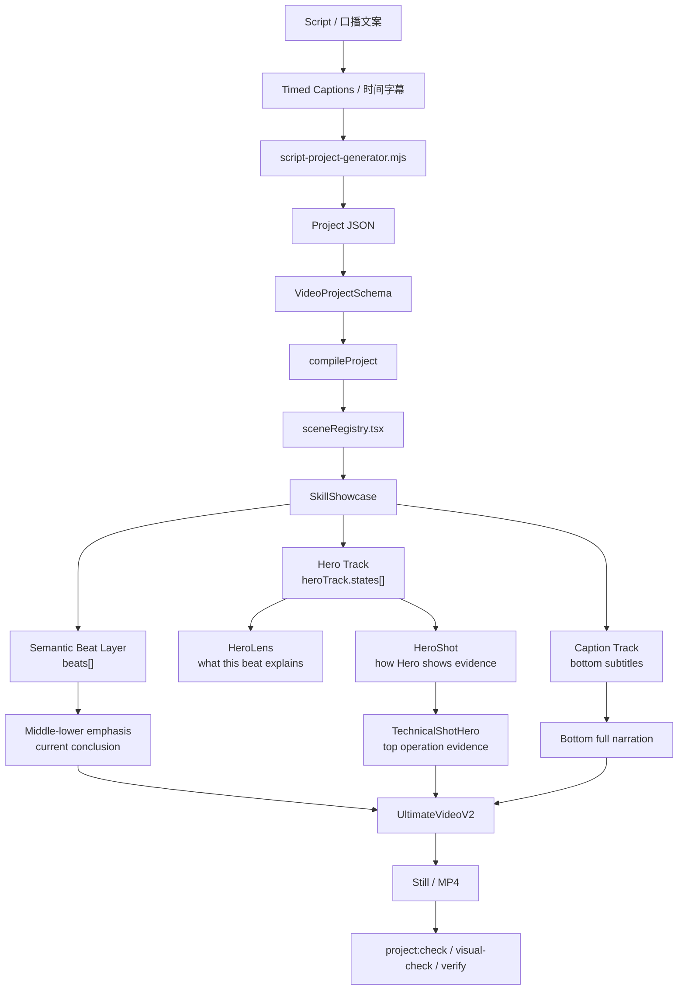

# 介绍

> 当前版本：2026-07-23
> 范围：现仓库真实可运行的 Skill Showcase 竖屏生产链路

## 1. 一句话

视频不是从“挑一个组件”开始，而是从当前口播字幕句开始：生成器按 `captionIndex` 生成 `beat`、`lens` 和 `shot`，再由 `HeroTrackV2` 把顶部主视觉、中下方语义节拍和底部字幕绑到同一条时间线上。

```text
口播 / timed captions
  -> captionIndex
  -> beat
  -> lens
  -> shot
  -> HeroTrackState
  -> HeroTrackV2 / TechnicalShotHero
  -> UltimateVideoV2
  -> Still / MP4 / Verify
```

## 2. 总关系图



## 3. 三层画面职责

| 区域 | 职责 | 数据来源 |
|---|---|---|
| 顶部主视觉区 | 展示当前口播句对应的实操证据和技术过程 | `heroTrack.states[].shot` |
| 中下方语义节拍区 | 强调当前结论、关键词、数量或判断 | `beats[]` |
| 底部字幕区 | 展示完整口播字幕 | `captions[]` |

顶部 Hero 不负责渲染大关键词海报。关键词和结论强调属于语义节拍层。

## 4. 关键术语

| 名称 | 含义 | 代码锚点 |
|---|---|---|
| `captionIndex` | 当前字幕句索引，驱动画面切换的最小单位 | `scripts/lib/script-project-generator.mjs` |
| `beat` | 语义节拍，中下方强调 | `SkillShowcaseBeat` in `types.ts` |
| `lens` | 语义合同：这一拍讲什么 | `HeroLens` in `types.ts` |
| `shot` | 导演镜头：顶部 Hero 怎么展示证据 | `HeroShot` in `types.ts` |
| `HeroTrackState` | 当前 Hero 状态，绑定 caption、lens、shot 和帧范围 | `HeroTrackState` in `types.ts` |
| `TechnicalShotHero` | 有 `state.shot` 时的顶部证据渲染器 | `HeroTrackV2.tsx` |
| `visual contract` | 检查 Hero 状态是否覆盖完整字幕范围和有效证据 | `scripts/lib/visual-contract.mjs` |

## 5. 当前主视觉目录

当前已接入生产并进入 Storyboard 验收的主视觉 catalog 是：

- 11 个 Cinematic preset：`beats[].shotPreset` 的电影化节拍语言。
- 9 个 Hero Track kind：`heroTrack.kind` 的稳定章节主视觉布局。

这 `11 + 9` 是当前 catalog，不是未来扩展上限。候选组件、实验组件、控制台预览组件可以存在，但不能写成当前生产链路。

## 6. 技术 Hero 镜头

10 种技术镜头是 `HeroTrackState.shot.kind`，只属于 `hero-track-v2` 内部导演镜头语法：

| kind | 用途 |
|---|---|
| `browser-demo` | 浏览器实操、DevTools、DOM 状态 |
| `terminal-execution` | 终端命令、CI、stdout |
| `code-diff` | 文件树、代码差异、修改行 |
| `config-check` | 配置文件、规则开关、环境参数 |
| `interface-audit` | 检查器、组件定位、问题扫描 |
| `flow-trace` | 输入、处理、输出的链路追踪 |
| `test-report` | 测试断言、通过/失败、回归结果 |
| `asset-library` | 素材库选择和匹配证据 |
| `system-map` | Prompt、Skill、Renderer、模块关系 |
| `before-after` | 旧状态与新状态对照 |

这些 kind 不是组件库扩充，不进入 `storyboardContract.json`。

## 7. 正确生成逻辑

```text
当前字幕句
  -> 匹配当前语义动作和信号
  -> 生成 beat
  -> 生成 lens.objective / lens.actionLabel
  -> 选择 shot.kind
  -> 填充 shot.environment / target / evidence
  -> 当前 Hero 行、面板或证据区域亮起
  -> 上一状态降级
  -> 下一字幕句接管
```

合同要求：

- `heroTrack.captionStartIndex` 和 `captionEndIndex` 必须匹配 scene 的 `captionRange`。
- `heroTrack.states[]` 必须覆盖完整字幕范围和完整 scene duration。
- 有 `shot` 的 state 必须有 `lens`。
- `shot.evidence` 必须包含可读操作证据。

## 8. 禁止回归

- 禁止新增 `NarrationSemanticSurface`。
- 禁止新增 `retargetHeroTrackForComponent`。
- 禁止向 `HeroTrackV2` 传 `componentId` 来把组件库硬塞进 Hero。
- 禁止把“扩充素材库”当成解决口播不匹配的主方案。
- 禁止只更新底部关键词/字幕，而顶部 Hero 和中下方语义节拍不跟随 `captionIndex`。
- 禁止把素材库动画匹配成与口播无关的画面。
- 禁止把 10 种技术 `shot.kind` 写成新的 Storyboard 组件。
- 禁止因为当前 catalog 是 20 个就删除未来候选组件源码；候选组件必须标注为未接入生产。
- 禁止把外部记忆库、Codex memory 或 Obsidian 旧副本当成当前架构真源。

本页已经内置当前链路的关键禁止项；任何新增结论必须继续回到下面的代码真源核验，不能只引用另一个文档。

## 9. 代码真源

| 职责 | 路径 |
|---|---|
| 生成器 | `remotion-video/scripts/lib/script-project-generator.mjs` |
| Project schema | `remotion-video/src/project/projectSchema.ts` |
| Scene payload schema | `remotion-video/src/project/sceneRegistry.tsx` |
| 编译合同 | `remotion-video/src/project/compileProject.ts` |
| 渲染路由 | `remotion-video/src/components/ultimate-kit/families/skill-showcase/skillShowcaseRouting.ts` |
| 类型合同 | `remotion-video/src/components/ultimate-kit/families/skill-showcase/types.ts` |
| Hero 渲染器 | `remotion-video/src/components/ultimate-kit/families/skill-showcase/HeroTrackV2.tsx` |
| 视觉合同 | `remotion-video/scripts/lib/visual-contract.mjs` |
| Storyboard catalog | `remotion-video/src/components/ultimate-kit/families/skill-showcase/storyboardContract.json` |

## 10. 验收命令

```bash
npm run typecheck
npm test
npm run project:check -- examples/skill-showcase.json
npm run project:visual-check -- examples/skill-showcase.json
npm run project:still -- examples/skill-showcase.json --frame 60 --out out/skill-showcase-still.png
```

视觉问题必须看真实 Still、接触表或 MP4，不能只看命令退出码。
