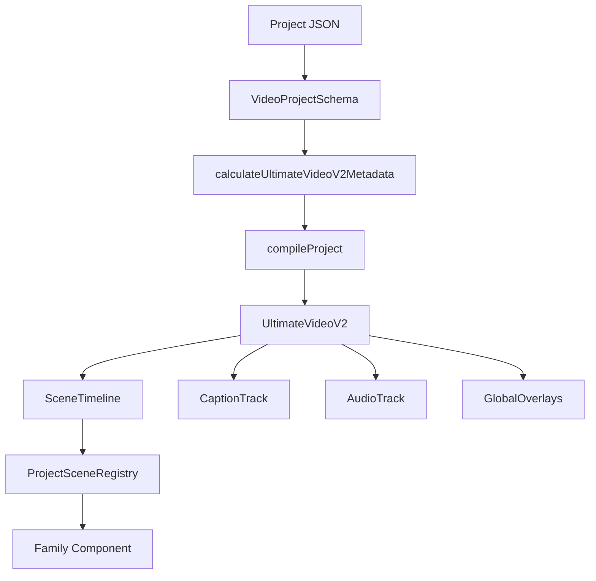
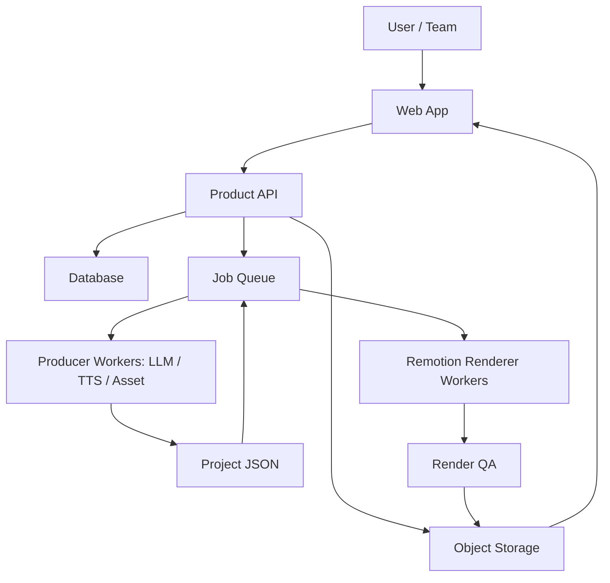

# Remotion 视频产品开发架构文档

> 版本：v2.0
> 日期：2026-07-19
> 适用仓库：`codex-remotion-project` / `remotion-video`
> 文档定位：围绕当前真实项目结构，重建产品开发文档，明确哪些需要保留、哪些暂时不需要、哪些留给产品上线阶段。

---

## 0. 总结论

当前仓库不是完整 SaaS 产品，也不是通用视频平台后端。它现在最有价值、也最应该被保护的核心，是一个稳定的 Remotion 渲染内核：

```text
Project JSON -> VideoProjectSchema -> compileProject() -> UltimateVideoV2 -> PNG / MP4
```

围绕 Remotion 上线产品时，正确方向不是把搜索、LLM、TTS、素材生成、队列、用户系统全部塞进 Remotion Composition，而是在 Remotion 内核外面增加产品层：

```text
Web 产品层
  -> API / Project / Job / Asset / User
  -> 生产管线：文案、视觉合同、TTS、素材
  -> Project JSON
  -> Remotion Renderer Worker
  -> MP4 / Still / QA / 下载
```

因此本文档重设为双层架构：

1. **当前必须真实维护的内核层**：`remotion-video/` 里的 Project JSON 合同、编译器、时间线、family 注册、CLI、控制台原型。
2. **后期产品上线才新增的产品层**：Web UI、API、数据库、任务队列、渲染 worker、素材存储、进度事件、账号权限、支付和运营后台。

---

## 1. 文档重新设计决策

旧版文档的问题不是信息少，而是把大量尚不存在的模块写成了当前架构，例如 `server/`、`pipeline/`、正式 WebSocket 协议、Express 项目 API、LLM Phase 1-4 编排。这样会让后续开发误以为仓库已经拥有完整产品后端。

新版文档做三件事：

1. 以当前源码和脚本为准，重画项目结构。
2. 把“不需要现在做”的内容明确剪掉，避免空转。
3. 保留 Remotion 产品上线目标，但把它放到清晰的 Roadmap 和新增目录建议里。

### 1.0 仓库真源

当前只维护一份开发真源：

```text
/Users/macos/OpenClaw/remotion-generated-video-project
```

旧副本：

```text
/Users/macos/remotion/remotion-video
```

旧副本只作为只读历史参考，不再作为审查、修复或产品开发对象。A/B 副本和文档收敛规则见 `docs/repository-consolidation.zh-CN.md`；所有文档入口见 `docs/README.zh-CN.md`。

### 1.1 需要保留

| 内容 | 原因 | 当前真源 |
| --- | --- | --- |
| Project JSON 作为唯一渲染输入 | 产品化后也应把它作为可审计、可复现的渲染合同 | `remotion-video/src/project/projectSchema.ts` |
| 编译阶段强校验 | 渲染前失败比渲染中黑屏更可控 | `remotion-video/src/project/compileProject.ts` |
| family 注册表 | 控制视觉能力边界，避免未知 family 静默降级 | `remotion-video/src/project/sceneRegistry.tsx`、`src/data/registry.ts` |
| CLI 渲染链路 | 当前最稳定的本地与 CI 入口 | `remotion-video/scripts/project-*.mjs` |
| `tools:studio` 本地控制台 | 产品控制台的原型参考，但不是正式 SaaS 后端 | `remotion-video/src/tools/console`、`scripts/tools-studio-server.mjs` |
| 生产前合同 | 适合继续承接 Topic Brief、Script Pack、Asset Pack 到 Project JSON | `remotion-video/examples/production`、`projects/*` |
| QA 与 verify | 上线后要进入 worker 的自动验收 | `verify-project-render.mjs`、`check-*` 脚本 |

### 1.2 当前不需要

| 不需要项 | 为什么不需要 |
| --- | --- |
| 在文档里声明已存在的 Express / WebSocket 产品后端 | 仓库当前没有正式 `server/`，只有本地 tools server |
| 把 LLM、搜索、TTS 写进 Remotion 运行时 | 渲染必须确定性，不应依赖不稳定外部服务 |
| 为每个未来功能预写详细 API 协议 | 现在缺少数据库、鉴权、任务模型，细 API 会过早锁死 |
| 硬编码 family 总数 | 当前 registry 会变，文档应指向源码真源 |
| 复制大段 Zod schema | 容易过时，文档只解释关键合同和边界 |
| 旧 Step 1-8 workflow / OpenClaw Skill runtime | 当前 README 和架构边界已明确不作为运行时入口 |
| 一开始建设完整多租户 SaaS 套件 | MVP 应先跑通单用户/小团队的项目、渲染、下载、QA |

### 1.3 后期产品上线需要

| 需要项 | 触发时机 |
| --- | --- |
| 正式 Web App | 开始让非开发用户创建视频时 |
| 正式 API 服务 | 需要账号、项目保存、任务状态、素材上传时 |
| 数据库 | 需要跨会话保存项目、任务、资产、用户、账单时 |
| 渲染队列 | 同时存在多个渲染任务或需要失败重试时 |
| Renderer Worker | 渲染从本地 CLI 迁移到服务器或云端时 |
| 对象存储 / CDN | 需要上传素材、保存 MP4、生成下载链接时 |
| 进度事件 | 用户需要看到生成、配音、渲染、验收进度时 |
| 账号权限 / 审计 | 多用户、多团队或商业上线时 |
| 成本控制 | 使用 LLM、TTS、云渲染、存储产生真实费用时 |

---

## 2. 当前项目结构

### 2.1 顶层结构

```text
remotion-generated-video-project/
  package.json
  README.md
  ARCHITECTURE.md
  docs/
    product-architecture.zh-CN.md
    superpowers/
  kb/
    00 首页.md
    01 当前项目总览.md
    02 Project JSON 合同.md
    03 V2 渲染架构.md
    ...
  remotion-video/
    package.json
    remotion.config.ts
    examples/
    projects/
    public/
    runtime/
    scripts/
    src/
    out/
```

顶层 `package.json` 只是转发入口。真实代码和运行脚本集中在 `remotion-video/`。

### 2.2 `remotion-video/` 结构

```text
remotion-video/
  examples/                  可直接校验和渲染的 Project JSON 示例
  examples/production/       Topic Brief / Script Pack / Asset Pack 示例
  projects/                  本地生产项目工作区
  public/                    Remotion 可访问的静态资产根目录
  runtime/                   本地运行缓存、临时任务、TTS 中间产物
  scripts/                   CLI、生产转换、TTS、QA、工具控制台 server
  src/
    Root.tsx                 Remotion Composition 注册入口
    project/                 Project schema、编译、资产解析、family 注册
    compositions/v2/         UltimateVideoV2 主渲染入口
    timeline/                Scene / Caption / Audio / GlobalOverlays
    components/              family 组件和视觉原子
    data/                    family registry、样片数据、生成数据
    tools/console/           本地 Video Factory Console
    render/                  图标、TTS driver、视觉辅助
    runtime/                 运行时辅助模块
    types/                   共享类型
  out/                       still、MP4、QA 图像输出
```

---

## 3. 当前内核架构

### 3.1 渲染主线



关键规则：

| 规则 | 说明 |
| --- | --- |
| `Project JSON` 是运行时唯一输入 | 所有上游生产结果最终必须落到 Project JSON |
| `schemaVersion` 当前为 `1` | 变更合同必须有迁移策略 |
| `fps` 固定为 `30` | 当前 schema 使用 `z.literal(30)` |
| 实际宽高由 `orientation` 决定 | `portrait` 编译为 `1080x1920`，`landscape` 编译为 `1920x1080` |
| `scenes[]` 是唯一时长来源 | 有 `captionRange` 时，场景帧数必须由字幕时间换算 |
| 渲染期间不生成素材 | 搜索、LLM、TTS、图片生成必须发生在 Project JSON 之前 |

### 3.2 核心文件职责

| 文件 | 职责 | 产品化时是否保留 |
| --- | --- | --- |
| `src/Root.tsx` | 注册 `UltimateVideoV2`、竖屏版本和 Tools composition | 保留 |
| `src/project/projectSchema.ts` | Project 顶层 Zod 合同 | 保留，未来可抽包 |
| `src/project/compileProject.ts` | 计算总时长、校验字幕区间、解析资产、输出 diagnostics | 保留，禁止做远程请求 |
| `src/project/assetResolver.ts` | 解析本地/远程资产路径，处理 required/fallback | 保留 |
| `src/project/sceneRegistry.tsx` | family 名称校验、payload schema、组件映射、accent fallback | 保留 |
| `src/compositions/v2/calculateMetadata.ts` | Remotion metadata 阶段编译 Project | 保留 |
| `src/compositions/v2/UltimateVideoV2.tsx` | 装配 Scene、Caption、Audio、Overlay 四条轨道 | 保留 |
| `src/timeline/*` | 时间线渲染 | 保留 |
| `src/tools/console/*` | 本地生产控制台 | 保留为原型，可迁移到正式 Web |
| `scripts/tools-studio-server.mjs` | 本地文件编辑和命令执行 API | 开发保留，上线需替换 |

### 3.3 Composition

当前公开主 Composition：

| Composition | 用途 |
| --- | --- |
| `UltimateVideoV2` | 横屏默认主链路 |
| `UltimateVideoV2-Portrait` | 竖屏主链路 |
| `UltimateElementsLibrary` | 组件库预览 |
| `IconEmojiCapabilityPreview` | 图标和 emoji 能力检查 |
| `MorfeoStylePreview` | 风格预览 |
| `DirectorScorePreview` | 导演分预览 |
| `AdaptiveVerification` | 自适应验证 |
| `MultiPlatformComparison` | 多平台对比检查 |

产品上线时，对外只暴露视频生成能力，不应让用户直接选择内部 Tools composition。

---

## 4. Project JSON 合同摘要

真源是 `remotion-video/src/project/projectSchema.ts`。文档只保留开发者必须理解的摘要，避免复制整份 schema。

```ts
type VideoProject = {
  schemaVersion: 1;
  projectId: string;
  title: string;
  render: {
    fps: 30;
    width: number;
    height: number;
    qualityMode: 'fast' | 'cinematic';
    orientation: 'landscape' | 'portrait';
    captionStyle: 'boxed' | 'editorial';
    showProjectLabel: boolean;
  };
  scenes: Array<{
    id: string;
    family: string;
    durationInFrames: number;
    captionRange?: {startIndex: number; endIndex: number};
    payload: Record<string, unknown>;
    assetIds: string[];
    transition: false | {type: 'fade' | 'slide'; durationInFrames: number};
  }>;
  captions: Array<{
    text: string;
    startMs: number;
    endMs: number;
    timestampMs: number | null;
    confidence: number | null;
  }>;
  audio: {
    voiceAssetId?: string;
    musicAssetId?: string;
  };
  assets: Record<string, {
    kind: 'image' | 'audio' | 'video' | 'font' | 'json';
    src: string;
    required: boolean;
  }>;
};
```

### 4.1 合同边界

| 主题 | 规则 |
| --- | --- |
| 字幕 | `endMs` 必须大于 `startMs`，超出总时长会被裁剪并产生 warning |
| 场景 | `id` 项目内唯一，`family` 必须已注册 |
| 字幕区间 | 使用 `captionRange` 时必须所有 scene 都声明，且连续、不重叠 |
| transition | 最后一段 transition 会被忽略；transition 必须短于下一段 scene |
| 资产 | 本地路径相对 `public/`，远程资产只接受安全来源，required 资产缺失要失败 |
| skill-showcase | 新稿必须有 `sourceText` 和 beats，防止只换字幕/配音而沿用旧画面 |

---

## 5. 当前开发工作流

### 5.1 环境与基础命令

```bash
npm run setup
npm run dev
npm run typecheck
npm test
```

顶层脚本会进入 `remotion-video/` 执行。开发 Remotion UI 时使用 `npm run dev` 打开 Remotion Studio。

### 5.2 Project JSON 验收

```bash
npm run project:check -- examples/project.json
npm run project:still -- examples/project.json --frame 30
npm run project:render -- examples/project.json --out out/project.mp4
```

对于竖屏口播样片：

```bash
cd remotion-video
npm run skill:gate
npm run project:check -- examples/skill-showcase.json
npm run project:still -- examples/skill-showcase.json --frame 60 --out out/skill-showcase-f60.png --scale=0.5
npm run skill:render
npm run skill:verify
```

### 5.3 生产前合同链路

当前本地生产链路已经在工具控制台文档中收敛为：

```text
Topic Brief -> Script Pack -> Asset Pack -> Project JSON -> Still -> Render QA
```

脚本映射：

| 节点 | 产物 | 命令 |
| --- | --- | --- |
| Topic Brief | `brief.json`、`sources.md`、项目目录 | `npm run production:scaffold -- "标题" --link <url> --id <projectId>` |
| Script Pack | `script-pack.json` | `npm run production:check -- <production-dir>` |
| Asset Pack | `asset-pack.json`、`public/projects/<id>/...` | `npm run production:check -- <production-dir>` |
| Project JSON | `project.json` | `npm run production:build-project -- <production-dir>` |
| Still | PNG | `npm run project:still -- <project.json> --frame 30` |
| Render QA | MP4 + verify | `npm run project:render -- <project.json> --out <mp4>` |

这条链路适合作为产品化 MVP 的业务流程原型。

---

## 6. 本地控制台定位

当前 `tools:studio` 是开发工具，不是上线产品：

```bash
cd remotion-video
npm run tools:studio
```

它由两部分组成：

| 模块 | 文件 | 作用 |
| --- | --- | --- |
| 前端控制台 | `src/tools/console/*` | 项目选择、文件编辑、预览、命令队列 |
| 本地 server | `scripts/tools-studio-server.mjs` | 读取/写入 JSON、启动 CLI job、提供 artifact |

当前 server 的能力：

- `GET /api/health`
- `GET /api/projects`
- `GET /api/files?path=...`
- `POST /api/files`
- `POST /api/jobs`
- `GET /api/jobs/:id`
- `GET /api/artifact?path=...`

上线时不要直接把它暴露到公网。原因：

1. 它直接写本地文件。
2. 它直接 spawn 本地命令。
3. 它没有账号、权限、租户隔离和审计。
4. 它使用内存 job map，进程重启即丢状态。

产品化时可以复用 UI 信息架构和命令映射，但必须替换为正式 API、数据库、队列和 worker。

---

## 7. 产品化目标架构

### 7.1 上线后的推荐分层



核心原则：**Remotion 只负责把确定的 Project JSON 渲染成确定的产物。**

### 7.2 建议新增目录

产品化阶段建议新增在仓库顶层，不要把正式产品后端塞进 `remotion-video/scripts/`：

```text
remotion-generated-video-project/
  apps/
    web/                    正式产品前端
    api/                    正式产品 API
  workers/
    render-worker/          Remotion 渲染 worker
    producer-worker/        文案、视觉合同、TTS、素材生产 worker
  packages/
    project-contract/       可选：从 remotion-video 抽出的 Project JSON schema
    render-client/          可选：API 调用渲染 worker 的客户端
  remotion-video/           继续作为渲染内核包
```

MVP 早期也可以先不抽 `packages/project-contract`，但一旦 API 和 worker 都需要校验 Project JSON，就应该抽出共享包，避免 schema 复制。

### 7.3 产品层模块

| 模块 | 职责 | 当前仓库可复用 |
| --- | --- | --- |
| Project Service | 项目创建、草稿、版本、状态 | `examples/production` 的合同思想 |
| Script Service | 文案输入、分段、字幕、语义结构 | `project:from-script` 的生成方向 |
| Visual Contract Service | family 选择、payload、beats、图标 | `sceneRegistry`、`registry.ts`、visual contract checks |
| TTS Service | voice 生成、字幕对齐、音频保存 | `generate-tts-for-project.mjs` 的经验 |
| Asset Service | 上传、下载、转码、静态路径、CDN | `public/projects/*` 的路径约定 |
| Render Service | still、MP4、重试、取消、并发控制 | `project-still.mjs`、`project-render.mjs` |
| QA Service | ffprobe、黑屏、时长、规格、视觉合同 | `verify-project-render.mjs`、`check-*` |
| Console / Dashboard | 项目流转、进度、错误解释、下载 | `src/tools/console` 的信息架构 |

---

## 8. 产品上线最小闭环

### 8.1 MVP 用户路径

```text
登录
  -> 创建项目
  -> 输入或上传口播稿
  -> 选择画幅、风格、声音
  -> 生成场景和字幕
  -> 预览 Project JSON 摘要和关键帧
  -> 渲染 MP4
  -> 自动 QA
  -> 下载或分享
```

MVP 不需要把所有 family 暴露给用户。更适合做三个高质量入口：

| 产品入口 | 背后 family 策略 |
| --- | --- |
| 竖屏口播 | `skill-showcase` / spoken / minimal |
| 横屏产品介绍 | ultimate family 组合 |
| 技术解释视频 | code / terminal / architecture / step-flow / metrics |

### 8.2 MVP 必需能力

| 能力 | 必需程度 | 说明 |
| --- | --- | --- |
| 账号登录 | 必需 | 至少支持单团队或邀请制 |
| 项目保存 | 必需 | 保存 script、Project JSON、渲染结果 |
| Project JSON 校验 | 必需 | API 和 worker 都要校验 |
| Still 预览 | 必需 | 用户确认画面前不直接烧高成本 MP4 |
| MP4 渲染 | 必需 | 产品核心价值 |
| 渲染进度 | 必需 | 至少有 queued/running/done/failed |
| 错误解释 | 必需 | 把 schema、资产、渲染错误翻译成用户可处理文案 |
| 下载链接 | 必需 | MP4、封面、字幕文件 |
| 重试 | 必需 | TTS、素材、渲染都可能失败 |
| 成本日志 | 必需 | 记录 LLM/TTS/渲染耗时和费用估算 |

### 8.3 MVP 暂不需要

| 能力 | 延后原因 |
| --- | --- |
| 多工作区复杂权限 | 先做单团队或邀请制即可 |
| 完整模板市场 | 先用少量高质量场景族验证转化 |
| 用户自定义任意动画 | 会破坏可控渲染和 QA |
| 实时协作编辑 | 当前核心瓶颈是生成和渲染闭环 |
| 超长视频批量渲染 | 先限制时长，保护成本和稳定性 |
| 4K / HDR / 多码率 | MVP 先保证 1080p 稳定 |
| 复杂支付计费 | 可先用额度或人工开通 |

---

## 9. 正式 API 边界

当前不应该在文档中宣称这些 API 已存在。它们是产品化阶段建议接口。

### 9.1 最小资源模型

```text
User
Team
Project
ProjectVersion
Asset
Job
RenderArtifact
QaReport
```

### 9.2 API 草案

| API | 作用 |
| --- | --- |
| `POST /projects` | 创建项目 |
| `GET /projects` | 项目列表 |
| `GET /projects/:id` | 项目详情 |
| `POST /projects/:id/script` | 上传或更新文案 |
| `POST /projects/:id/generate` | 生成 Project JSON 草稿 |
| `POST /projects/:id/still` | 生成关键帧 |
| `POST /projects/:id/render` | 创建 MP4 渲染任务 |
| `GET /jobs/:id` | 查询任务状态 |
| `GET /jobs/:id/events` | SSE 进度事件 |
| `GET /artifacts/:id/download` | 下载产物 |

### 9.3 状态机

```text
draft
  -> generating
  -> ready_for_review
  -> still_rendering
  -> still_ready
  -> render_queued
  -> rendering
  -> qa_running
  -> completed
```

失败状态：

```text
generation_failed
asset_failed
schema_failed
render_failed
qa_failed
cancelled
```

任务状态必须持久化到数据库，不能只存在内存里。

---

## 10. Renderer Worker 设计

产品上线时，渲染 worker 只接收已校验或即将校验的 Project JSON，不接收自然语言需求。

### 10.1 输入

```ts
type RenderJobInput = {
  jobId: string;
  projectId: string;
  versionId: string;
  projectJson: VideoProject;
  output: {
    kind: 'still' | 'video';
    frame?: number;
    format: 'png' | 'mp4';
  };
};
```

### 10.2 输出

```ts
type RenderJobResult = {
  jobId: string;
  status: 'completed' | 'failed';
  artifactIds: string[];
  diagnostics: Array<{
    level: 'info' | 'warning' | 'error';
    code: string;
    message: string;
    path?: string;
  }>;
  durationMs: number;
};
```

### 10.3 Worker 规则

| 规则 | 说明 |
| --- | --- |
| 每个 job 使用隔离工作目录 | 防止不同用户资产污染 |
| 渲染前运行 schema check | 防止无效 Project 进入 Remotion |
| 渲染后运行 QA | 验证分辨率、fps、时长、可解码 |
| 失败要记录可读错误 | schema path、asset id、render stack 都要保存 |
| 支持取消和超时 | 长渲染必须可终止 |
| 产物上传对象存储 | worker 本地输出不是最终状态 |

---

## 11. 素材与资产策略

当前 Remotion 内核的资产规则应继续保留：

| 规则 | 当前行为 | 产品化延伸 |
| --- | --- | --- |
| 本地资产相对 `public/` | `src` 不带 `public/` 前缀 | 上传后生成受控相对路径或签名 URL |
| required 资产缺失失败 | 音频等必需资产不能 fallback | API 提前拦截并提示补齐 |
| 可选视觉资产 fallback | 缺失图片可显示占位 | QA 标记 warning |
| voice / music 分轨 | 编译成 audio tracks | 产品 UI 暴露音量、背景音乐开关 |

上线后建议把资产分为：

| 类型 | 保存位置 | 说明 |
| --- | --- | --- |
| 用户上传素材 | Object Storage | 图片、视频、logo、字体 |
| 生成素材 | Object Storage | AI 图、TTS 音频、截图 |
| 渲染产物 | Object Storage + CDN | MP4、PNG、字幕、QA 报告 |
| 临时素材 | Worker local temp | job 结束清理 |

---

## 12. 安全、稳定性和成本

产品上线前必须补齐这些非视觉能力：

| 主题 | 必需措施 |
| --- | --- |
| 鉴权 | 所有 project、asset、job 都绑定 user/team |
| 租户隔离 | 用户不能通过路径读取其他用户文件 |
| 路径安全 | 禁止绝对路径、`..`、任意 shell 参数 |
| 命令执行 | API 不直接拼接 shell 字符串，worker 使用白名单命令 |
| 文件上传 | 限制类型、大小、总容量、扫描元数据 |
| 超时 | LLM、TTS、下载、渲染都要有 timeout |
| 重试 | 只对幂等任务重试，渲染和 TTS 记录 attempt |
| 费用 | 每个 job 记录 token、TTS 秒数、渲染秒数、存储大小 |
| 审计 | 记录谁创建、修改、渲染、下载 |
| 可观测性 | logs、metrics、trace、失败分类 |

---

## 13. Roadmap

### P0：内核稳定化

目标：继续保护当前 Remotion 内核。

- 保持 `project-development.zh-CN.md` 只链接源码真源，不维护第二份 family 表。
- 保持 `project:check`、`project:still`、`project:render`、`project:verify` 可用。
- 给新增 family 补 payload schema、示例、测试和 still QA。
- 把 `skill-showcase` 换稿防污染规则继续作为强 gate。

### P1：产品 MVP 原型

目标：让非开发用户在本地或内网完成一条视频。

- 基于 `src/tools/console` 收敛为真正项目流。
- 增加项目版本、关键帧预览、错误解释。
- 用本地文件存储替代内存 job，保证重启后可恢复。
- 限制渲染并发为 1-2 个任务。
- 只支持 1080p 横屏/竖屏和短视频时长。

### P2：正式产品服务

目标：从本地工具升级为可上线系统。

- 新增 `apps/web`、`apps/api`、`workers/render-worker`。
- 引入数据库、对象存储、队列、鉴权。
- API 持久化 Project JSON、assets、jobs、artifacts。
- worker 使用 Remotion renderer 或云渲染方案执行 still / MP4。
- 增加 SSE 进度、失败重试、取消任务、下载链接。

### P3：商业化与规模化

目标：稳定服务多个团队和更高并发。

- 多团队权限、额度、账单。
- 渲染 worker 自动伸缩。
- 素材库、品牌包、模板包。
- 更细的 QA：黑屏、字幕遮挡、音画时长、品牌一致性。
- 运营后台：失败任务、费用、热模板、用户行为。

---

## 14. 改动守则

### 14.1 改内核

涉及这些文件时必须跑完整检查：

| 改动范围 | 必跑 |
| --- | --- |
| `src/project/*` | `npm test`、`npm run project:check -- examples/project.json` |
| `src/compositions/v2/*` | `npm run typecheck`、still、render smoke |
| `src/timeline/*` | still、render、verify |
| family component | family 示例 still、`project:check` |
| `sceneRegistry.tsx` | payload schema 测试、未知 family 失败测试 |

### 14.2 改产品层

产品化新增代码必须遵守：

1. 不绕过 Project JSON。
2. 不让 Remotion Composition 访问数据库、LLM、TTS 或搜索。
3. 所有 job 可重放、可审计、可失败恢复。
4. API 层和 worker 层都校验 Project JSON。
5. 用户可见错误必须能定位到文案、素材、字幕、family 或渲染阶段。

---

## 15. 文档地图

| 文档 | 用途 |
| --- | --- |
| `README.md` | 项目快速开始 |
| `docs/README.zh-CN.md` | 全项目文档总入口 |
| `docs/repository-consolidation.zh-CN.md` | A/B 副本和文档整合规则 |
| `ARCHITECTURE.md` | 最小内核边界 |
| `kb/01 当前项目总览.md` | 当前样片和真源文件 |
| `kb/02 Project JSON 合同.md` | Project JSON 细规则 |
| `kb/03 V2 渲染架构.md` | 编译和渲染链路 |
| `kb/07 开发代码约束.md` | 工程约束和禁区 |
| `remotion-video/docs/video-factory-console-design.zh-CN.md` | 本地控制台设计 |
| `remotion-video/docs/project-development.zh-CN.md` | Remotion 内核开发手册 |
| `docs/product-architecture.zh-CN.md` | 产品化总架构和取舍 |

---

## 16. 最终取舍

当前要继续押注的东西：

- Project JSON 合同。
- Remotion 编译和渲染内核。
- 语义驱动的 family / beat 视觉合同。
- still -> render -> verify 的质量闸门。
- 本地控制台作为未来产品台的原型。

当前要停止扩散的东西：

- 把未实现后端写成已存在架构。
- 在 Remotion 渲染时做 LLM、TTS、搜索、下载。
- 为未来 SaaS 过早设计过细 API。
- 用旧样片资产污染新口播。
- 只换字幕和配音，不重建视觉合同。

后期产品上线的主路线：

```text
保留 remotion-video 作为稳定渲染内核
  -> 新增正式 Web / API / Queue / Worker
  -> 所有生成结果落到 Project JSON
  -> Remotion worker 负责 still、MP4、QA
  -> 对用户交付可预览、可下载、可追踪的视频产品
```
