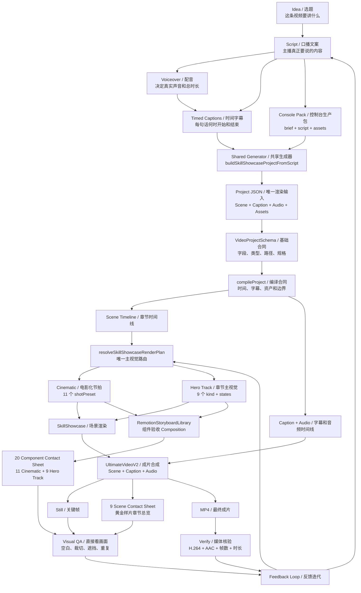

# 视频制作流程关系图谱（全局介绍）

> 更新时间：2026-07-21
> 适用范围：当前唯一的 Skill Showcase 竖屏生产链路
> 目标读者：不熟悉代码，但需要准确沟通视频内容、画面、节奏和验收的人

## 0. 一句话先讲明白

一条视频不是从“挑一个好看的组件”开始，而是先确定口播要表达什么，再由同一个生成器把文案、字幕、Scene、Beat 和 Hero state 绑定到一条时间轴，最后选择 11 Cinematic 或 9 Hero Track 中的真实画面。

```text
选题 / 口播
  -> 配音与时间字幕
  -> Skill Showcase Project JSON
  -> Schema / compileProject
  -> Scene / Beat / Hero state
  -> 11 Cinematic + 9 Hero Track
  -> UltimateVideoV2
  -> Still / 接触表 / MP4
  -> 直接看画面 + Verify
```

## 1. 总关系图



## 2. 每个名字是什么意思

| 英文名 | 中文名 | 小白解释 | 可以怎么说 |
|---|---|---|---|
| `Idea` | 选题 | 这条视频要讲什么 | “这条讲 AI 视频生产链路” |
| `Script` | 口播文案 | 主播完整念出来的内容 | “这句话太泛，要更具体” |
| `Voiceover` | 配音 | 声音文件，决定真实节奏 | “这里声音快，画面也要跟上” |
| `Timed Captions` | 时间字幕 | 每句话何时出现和结束 | “这一句字幕晚了半秒” |
| `Project JSON` | 渲染合同 | 全片唯一结构化输入 | “先重新生成项目，不要只换字幕” |
| `Scene` | 章节 | 一段完整内容的时间范围 | “这一章讲代码到 MP4” |
| `Beat` | 语义节拍 | Scene 内某一句话的视觉重点 | “说到验证时要锁定结果” |
| `Hero Track State` | 主视觉状态 | 章节主体随口播变化的状态 | “这一段主体从输入走到结果” |
| `Cinematic preset` | 电影化节拍组件 | 用于重音、对比、扫描、聚合、转场 | “这一拍用分屏擦除” |
| `Hero Track kind` | 章节主视觉组件 | 长时间承载能力矩阵、代码、PPT、文章等主体 | “这一章用代码渲染轨道” |
| `Composition` | 视频合成入口 | 把 Scene、字幕和音频排成完整视频 | “用同一个 Composition 出 Still 和 MP4” |
| `Contact Sheet` | 接触表 | 把多个关键帧拼成一张总览 | “先看 20 个组件有没有重复或空白” |
| `Visual QA` | 画面审核 | 直接查看真实图片或视频 | “退出码通过不等于画面通过” |
| `Verify` | 媒体核验 | 检查编码、尺寸、帧率、时长和完整解码 | “确认 H.264/AAC 和项目帧数一致” |

## 3. 11 Cinematic 与 9 Hero Track 的关系

它们属于同一个 `skill-showcase` family，并共用 Project JSON、Schema、时间轴和 `UltimateVideoV2`。

```text
Scene 需要章节主体持续变化
  -> heroStyle = hero-track-v2
  -> heroTrack.kind + heroTrack.states
  -> 9 个 Hero Track 之一

Scene 需要按 Beat 做电影化强调
  -> heroStyle = cinematic
  -> beats[].shotPreset
  -> 11 个 Cinematic 之一
```

`payload.variant` 只描述章节内容语义，不是第三套视觉组件。黄金样片的 9 个 Scene 也不是组件目录。

全部 20 个组件、用途和真实渲染图见 [KB：11 Cinematic + 9 Hero Track](<../kb/03 11 Cinematic + 9 Hero Track.md>)。

## 4. 一句话如何进入真实画面

示例口播：

> 输入经过规则处理，最后形成可验证结果。

| 步骤 | 当前系统中的结果 |
|---|---|
| 这句话在讲什么 | 输入、规则、输出和验证 |
| Scene 主体需要什么 | 通用流程可用 `generic-explainer`，复杂章节可用对应 Hero Track |
| Beat 强调需要什么 | 流程推进可用 `pipeline-flow`，结论收束可用 `system-convergence` |
| 时间从哪里来 | caption 的 `startMs/endMs` 生成 Scene、Beat 和 state 帧范围 |
| 数据写到哪里 | 当前 Project JSON 的 `scene.payload` |
| 最终如何确认 | 先看 Still/接触表，再渲染 MP4 并执行 Verify |

重点不是手动指定越多越好，而是让生成器根据当前口播重新生成完整 payload，避免继承上一条视频的品牌、实体和结论。

## 5. 沟通视频效果的推荐格式

```text
这句话：
“输入经过规则处理，最后形成可验证结果。”

我想表达：
流程 / 可验证 / 结果收束

我不想要：
只有文字框 / 主体不动 / 和上一章重复

我想要：
输入真的穿过规则节点，输出被明确锁定，字幕不被遮挡
```

对应修改位置：

| 你说的问题 | 通常检查哪里 |
|---|---|
| “这一章主体类型不对” | `heroTrack.kind` 或生成器语义映射 |
| “这一拍强调方式不对” | `beats[].shotPreset` |
| “字幕和画面对不上” | captions、captionRange、Beat/state 帧范围 |
| “连续几段太像” | Scene 的 Hero kind 分布和 Beat preset 分布 |
| “画面太空或压字幕” | Storyboard 安全区、组件布局和真实 Still |
| “测试过了但不好看” | 直接打开 Still、9 Scene 接触表和 20 组件接触表 |

## 6. 当前项目里的真源

| 职责 | 文件或命令 |
|---|---|
| 口播生成 Project | `scripts/lib/script-project-generator.mjs` |
| Project 基础 Schema | `src/project/projectSchema.ts` |
| Scene payload Schema | `src/project/sceneRegistry.tsx` |
| 编译与时间合同 | `src/project/compileProject.ts` |
| 唯一视觉路由 | `skillShowcaseRouting.ts` |
| 11 Cinematic | `PortraitCinematicSkillShowcase.tsx` |
| 9 Hero Track | `HeroTrackV2.tsx` |
| 成片 Composition | `UltimateVideoV2` |
| 20 组件 Composition | `RemotionStoryboardLibrary` |
| 20 组件目录 | `storyboardContract.json` |
| Project 检查 | `npm run project:check -- examples/skill-showcase.json` |
| 组件验收 | `npm --prefix remotion-video run storyboard:render` |
| 成片验证 | `npm --prefix remotion-video run skill:verify` |

所有源码路径以上面的 `remotion-video/` 为根目录。
