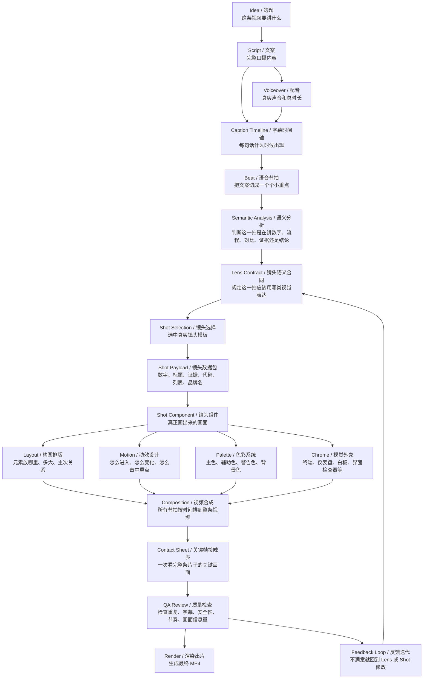

# 视频制作流程关系图谱（小白沟通版）

> 更新时间：2026-07-20
> 适用范围：Remotion OpenClaw 的口播驱动视频、Skill Showcase、Swiss Skill Spoken、Technical Evidence Workbench
> 目标读者：不熟悉代码、不熟悉英文术语，但需要和 Codex 准确沟通视频效果的人。

## 0. 一句话先讲明白

一条理想的视频，不是从“做个好看的画面”开始，而是从“这句话到底想让观众理解什么”开始。

正确流程是：

```text
文案内容
  -> 判断每句话的意思
  -> 选择适合的镜头类型
  -> 填入数字、证据、标题、代码、列表
  -> 按固定的构图、颜色、动效规则渲染
  -> 抽关键帧检查
  -> 最后出 MP4
```

如果直接从“画面”开始，很容易出现这次遇到的问题：全是框框、文字、数字，看起来像测试稿，不像真实技术博主视频。

## 1. 总关系图



## 2. 每个名字到底是什么意思

| 英文名 | 中文名 | 小白解释 | 你可以怎么说 |
|---|---|---|---|
| `Idea` | 选题 | 这条视频要讲什么主题 | “这条是讲 AI 设计 Skill” |
| `Script` | 文案 | 主播要念出来的完整内容 | “这句话听起来太泛了” |
| `Voiceover` | 配音 | 声音文件，决定真实节奏 | “这里声音快了，画面也要跟上” |
| `Caption Timeline` | 字幕时间轴 | 每句字幕在第几秒出现 | “这一句出现太早/太晚” |
| `Beat` | 语音节拍 | 一句话或一句话里的一个重点 | “这一拍要强调 22K star” |
| `Semantic Analysis` | 语义分析 | 判断这句话的意思类型 | “这是证明，不是装饰” |
| `Lens Contract` | 镜头语义合同 | 规定这一拍该用哪一类画面 | “这句应该是开源证据镜头” |
| `Shot` | 真实镜头 | 具体画面模板 | “我要像技术博主讲 GitHub 项目的镜头” |
| `Payload` | 镜头数据包 | 填进镜头里的内容 | “数字是 22K，证据是 star” |
| `Layout` | 构图排版 | 元素放哪里、多大、谁最重要 | “主视觉往上，字幕上方留节拍动效” |
| `Motion` | 动效 | 元素怎么出现、移动、锁定、消失 | “不要只淡入淡出，要有语义击打” |
| `Palette` | 色彩系统 | 什么颜色代表重点、成功、警告 | “这段不要全紫，要有技术绿/蓝” |
| `Chrome` | 视觉外壳 | 画面像什么环境，例如终端、白板、HUD | “不要每一段都是浏览器框” |
| `Composition` | 视频合成 | 把所有镜头按时间拼成完整视频 | “保持原时间轴，不重配音” |
| `Contact Sheet` | 接触表 | 把每个关键节拍截图拼成一张总览图 | “先给我看 22 个镜头缩略图” |
| `QA Review` | 质量检查 | 检查视频有没有硬伤 | “看起来是不是重复、压字幕、太空” |
| `Render` | 渲染 | 输出最终 MP4 | “渲染出来给我看” |

## 3. Lens 和 Shot 的区别

这是最容易混的两个词。

### Lens / 镜头语义合同

`Lens` 回答的是：

```text
这句话应该用什么类型的视觉表达？
```

例如：

- 讲数字可信度：用 `repo-signal / 开源信号`
- 讲规则数量：用 `rule-counter / 规则计数`
- 讲前后差异：用 `snapshot-compare / 前后对照`
- 讲流程拦截：用 `skill-gate / Skill 闸门`

### Shot / 真实镜头

`Shot` 回答的是：

```text
这个画面具体长什么样、怎么排版、怎么动？
```

例如 `repo-signal / 开源信号` 可以对应一个真实镜头：

```text
左侧：22K STAR 大数字
中间：星形粒子聚合
右侧：Repo 证据面板
动效：星星逐个出现 -> 信号圈扩张 -> 证据卡亮起
```

所以：

```text
Lens = 选择哪种镜头语言
Shot = 真实画面怎么实现
```

## 4. 一句文案如何变成一个镜头

示例文案：

> 22000 star，是 AI 辅助设计必要的第一个。

系统应该这样理解：

| 步骤 | 结果 |
|---|---|
| 这句话在讲什么？ | 可信度、开源背书、技术证明 |
| 里面有什么关键信息？ | `22000 star` |
| 不适合什么画面？ | 普通数字卡片、纯文字框、泛泛的科技光效 |
| 适合什么画面？ | GitHub 项目感、Star 聚合、证据面板 |
| Lens 是什么？ | `repo-signal / 开源信号` |
| Shot 是什么？ | `Repo Signal Shot / 开源信号镜头` |
| Payload 填什么？ | `22K`、`STAR`、style entrypoints、repo trace、evidence |

然后画面设计成：

```text
┌──────────────────────────────────────────┐
│ REPO SIGNAL / OPEN-SOURCE PROOF          │
│                                          │
│   22K STAR             ┌──────────────┐  │
│                        │ Style Entries│  │
│   星形粒子聚合          ├──────────────┤  │
│                        │ Repo Trace   │  │
│                        ├──────────────┤  │
│                        │ Evidence     │  │
└──────────────────────────────────────────┘
```

## 5. 动效是怎么设计出来的

动效不是“随便飞一下”，它要服务这句话的意思。

一拍通常拆成五段：

| 节拍进度 | 中文名 | 作用 |
|---|---|---|
| `0.00–0.14` | 入场 | 画面建立，告诉观众进入新镜头 |
| `0.15–0.35` | 搭建 | 主元素出现，例如数字、代码、节点 |
| `0.35–0.60` | 语义动作 | 真正表达意思：扫描、聚合、锁定、拦截 |
| `0.58–0.85` | 证据出现 | 日志、数据、检查结果、结论卡片出现 |
| `0.85–1.00` | 保持 | 给观众读字幕和看结论的时间 |

不同 Lens 的动效应该不同：

| Lens | 中文名 | 动效语法 |
|---|---|---|
| `terminal-run` | 终端运行 | 命令逐字输入，日志逐行出现，最后打勾 |
| `manifest-resolve` | 配置解析 | 多个文件节点连到中心 Skill Contract |
| `rule-counter` | 规则计数 | 环形刻度绘制，规则点飞入，中心数字锁定 |
| `live-scan` | 实时扫描 | 扫描光束从上到下穿过界面 |
| `snapshot-compare` | 前后对照 | 同一界面用擦除线做左右/上下对比 |
| `repo-signal` | 开源信号 | 星形粒子聚合成 `22K STAR`，证据面板亮起 |
| `style-lock` | 风格锁定 | 多个候选风格切换，最终锁定 Swiss |
| `anchor-map` | 主动锚定 | 准星在网格中移动，吸附到风格锚点 |
| `skill-gate` | Skill 闸门 | Prompt 沿管线穿过闸门，坏模板被拦截 |
| `token-assembly` | Token 组装 | 配色、字体、间距 token 流入界面 |
| `scenario-switch` | 场景切换 | 同一系统变形成官网、工具、作品集、后台 |
| `system-graph` | 系统图 | 节点逐个出现并连成可复用系统 |

## 6. 构图、颜色、运动轨迹从哪里来

理想的产品化系统里，每个 Shot 都应该有自己的固定规则。

例如 `Repo Signal Shot / 开源信号镜头`：

| 设计项 | 规则 |
|---|---|
| 构图 | 左侧大数字，右侧证据面板，底部避开字幕 |
| 主视觉 | `22K STAR` |
| 辅助视觉 | 星形粒子、信号圈、repo 列表 |
| 颜色 | 数字用高亮色，背景用技术黑，证据用绿色/蓝色 |
| 运动轨迹 | 星星按螺旋/聚合轨迹出现，不随机乱飞 |
| 击打点 | 语音说到 `star` 时，数字或信号圈锁定 |
| 退出 | 不突兀切黑，留给下一拍转场 |

这就是 `Shot Grammar / 镜头语法`。

中文理解就是：

```text
每种镜头都有自己的“拍法”。
不是每次重新想，而是像导演分镜模板一样复用。
```

## 7. 22 个技术镜头语义清单

| # | Lens 英文 | 中文名 | 适合什么文案 | 画面应该像什么 |
|---:|---|---|---|---|
| 1 | `source-diff` | 源码差异 | 改前改后、默认和优化 | 代码 Diff |
| 2 | `terminal-run` | 终端运行 | 执行、验证、跑命令 | 终端 + 日志 |
| 3 | `manifest-resolve` | 配置解析 | 装 Skill、加载规则、读取配置 | 文件节点连到核心合同 |
| 4 | `design-inspector` | 设计检查器 | 检查界面问题 | 真实界面 + Inspector 标注 |
| 5 | `rule-counter` | 规则计数 | 37 条规则、数量证明 | 大数字 + 环形刻度 |
| 6 | `category-index` | 类别索引 | 八类规则、分类体系 | 节点星图 |
| 7 | `live-scan` | 实时扫描 | 实时检测、自动标注 | 扫描光束扫过界面 |
| 8 | `snapshot-compare` | 前后对照 | 完全不同结果、左右对比 | 同一界面擦除对比 |
| 9 | `repo-signal` | 开源信号 | star、GitHub、开源背书 | 大数字 + 星粒子 + repo 证据 |
| 10 | `direction-picker` | 方向选择 | 审美方向、风格选择 | 多张风格卡展开 |
| 11 | `style-lock` | 风格锁定 | 锁定 Swiss、固定风格 | 候选模式切换后锁定 |
| 12 | `anchor-map` | 主动锚定 | 记住方向、对齐风格 | 坐标网格 + 准星 |
| 13 | `deny-list` | 反模式清单 | 禁用默认词、避免 AI 味 | 坏词被划掉/击落 |
| 14 | `skill-gate` | Skill 闸门 | 从源头规避、拦截模板 | 输入穿过闸门，坏结果被挡 |
| 15 | `knowledge-vault` | 内置知识库 | 全部内置、资料库 | 环形资料库核心 |
| 16 | `catalog-metrics` | 数据目录 | 161/67/57/99 等数字 | 四组数据聚合 |
| 17 | `token-assembly` | Token 组装 | 设计系统、颜色字体间距 | Token 流入移动端界面 |
| 18 | `scenario-switch` | 场景切换 | 每个场景、官网工具后台 | 多种产品界面切换 |
| 19 | `blank-audit` | 空白审计 | 从零定义、没有默认系统 | 空白画布 + 缺失提示 |
| 20 | `brand-pack` | 品牌包 | 68 个品牌、品牌资料 | brand-pack 文件索引 |
| 21 | `brand-style-map` | 品牌风格地图 | Stripe、Linear、Vercel 等 | 多品牌风格列对照 |
| 22 | `system-graph` | 系统图 | 可复用系统、最终收束 | 多个 Skill 节点汇聚 |

## 8. 以后沟通视频效果的推荐格式

你可以不用说专业名词，按这个格式说就行：

```text
这句话：
“22000 star，是 AI 辅助设计必要的第一个。”

我想表达：
可信度 / 开源背书 / 技术证明

我不想要：
普通数字卡片 / 纯文字框 / 泛泛科技感

我想要：
像技术博主讲 GitHub 项目那样，有 star 聚合、有证据、有项目感
```

或者：

```text
这段我觉得太像测试稿。
原因：
连续几拍都是同一种框框。

我想改成：
有的像终端，有的像白板，有的像 GitHub 项目，有的像界面检查器。
```

我就能判断应该改的是：

| 你说的问题 | 通常要改哪里 |
|---|---|
| “这一句画面类型不对” | 改 Lens |
| “类型对，但画面不好看” | 改 Shot |
| “东西位置不对” | 改 Layout |
| “动得太少/太乱” | 改 Motion |
| “太紫/太暗/太花” | 改 Palette |
| “连续几段太像” | 改 Shot 分布或外壳 |
| “压字幕了” | 改安全区和排版 |
| “像测试，不像成片” | 增加真实技术证据、减少空框和占位文字 |

## 9. 当前项目里的对应位置

| 名称 | 中文 | 当前真源 |
|---|---|---|
| Lens 类型 | 镜头语义合同 | `remotion-video/src/components/ultimate-kit/families/skill-showcase/types.ts` |
| Lens 校验 | 合同守门 | `remotion-video/scripts/lib/visual-contract.mjs` |
| Swiss V5 Lens 映射 | 22 节拍对应 22 镜头语义 | `remotion-video/scripts/build-swiss-skill-spoken-v5-workbench.mjs` |
| Shot 渲染 | 真实画面组件 | `remotion-video/src/components/ultimate-kit/families/skill-showcase/TechnicalEvidenceWorkbench.tsx` |
| 项目 schema | Project JSON 校验 | `remotion-video/src/project/sceneRegistry.tsx` |
| V5 示例 | 当前样片合同 | `remotion-video/examples/swiss-skill-spoken-v5-workbench.json` |
| V5 成片 | 当前输出视频 | `remotion-video/out/swiss-skill-spoken-v5-workbench.mp4` |
| V5 接触表 | 22 镜头总览 | `remotion-video/out/swiss-v5-workbench/all-22-midpoints-large.jpg` |

## 10. 下一步产品化建议

现在已经有：

```text
22 个 Lens 语义
  + 一批可复用渲染组件
  + V5 样片
  + 合同校验
```

下一步应该做成：

```text
22 个独立 Shot 文件
  + 每个 Shot 的数据要求
  + 每个 Shot 的构图规则
  + 每个 Shot 的动效阶段
  + 每个 Shot 的失败 fallback
  + 自动接触表检查
```

这样以后做新视频时，不会再靠临时“凭感觉改画面”，而是像搭积木：

```text
这句话是开源证明 -> 选 Repo Signal Shot
这句话是风格锁定 -> 选 Style Lock Shot
这句话是流程拦截 -> 选 Skill Gate Shot
这句话是系统收束 -> 选 System Graph Shot
```

这就是后续理想产品的核心。
