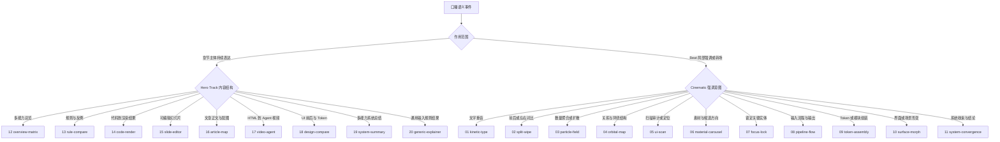

# 11 Cinematic + 9 Hero Track

20 个主视觉组件共享同一个 `skill-showcase` scene family，并由 `resolveSkillShowcaseRenderPlan()` 二选一。它们不是两条生产链路。

## 使用指南图谱

- Cinematic：设置 `payload.heroStyle = "cinematic"`，并在 `beats[].shotPreset` 选择 01-11。
- Hero Track：设置 `payload.heroStyle = "hero-track-v2"`，并在 `heroTrack.kind` 选择 12-20。
- `payload.heroTrack` 存在时路由优先进入 Hero Track；不要同时把两套模式当作并行主画面。

## Cinematic 11

| ID | `shotPreset` | 表达用途 |
|---:|---|---|
| 1 | `kinetic-type` | 动态排版、关键词重音 |
| 2 | `split-wipe` | 前后或左右对比 |
| 3 | `particle-field` | 数量、聚合、扩散信号 |
| 4 | `orbital-map` | 关系与环绕结构 |
| 5 | `ui-scan` | 扫描、审计、定位 |
| 6 | `material-carousel` | 素材与候选方向 |
| 7 | `focus-lock` | 锁定关键实体 |
| 8 | `pipeline-flow` | 输入、流程、输出 |
| 9 | `token-assembly` | 设计 Token 组装 |
| 10 | `surface-morph` | 界面或场景形变 |
| 11 | `system-convergence` | 系统收束与总结 |

## Hero Track 9

| ID | `heroTrack.kind` | 表达用途 |
|---:|---|---|
| 12 | `overview-matrix` | 能力总览矩阵 |
| 13 | `rule-compare` | 规则与反例对比 |
| 14 | `code-render` | 代码到渲染结果 |
| 15 | `slide-editor` | 可编辑幻灯片流程 |
| 16 | `article-map` | 文章、正文、配图链路 |
| 17 | `video-agent` | HTML 到 Agent 视频 |
| 18 | `design-compare` | UI 前后与 Token 对比 |
| 19 | `system-summary` | 多能力系统总结 |
| 20 | `generic-explainer` | 通用输入、规则、结果 |

## 唯一目录与视觉证据

- 目录合同：`remotion-video/src/components/ultimate-kit/families/skill-showcase/storyboardContract.json`
- Cinematic 实现：`PortraitCinematicSkillShowcase.tsx`
- Hero Track 实现：`HeroTrackV2.tsx`
- 路由实现：`skillShowcaseRouting.ts`
- 20 组件接触表：`remotion-video/out/remotion-storyboard-library/contact-all-20.png`

`npm --prefix remotion-video run storyboard:render` 必须报告 20 个唯一 PNG。仅生成文件不算视觉通过，还要直接打开接触表确认没有黑帧、空白、主内容裁切、遮挡或重复画面。

## 20 组件总览

以下图片全部由 `RemotionStoryboardLibrary` 在第 72 帧真实渲染，单图规格为 `1080x1920`。

## Cinematic 渲染图

| 01 `kinetic-type` | 02 `split-wipe` |
|---|---|
|  |  |
| 03 `particle-field` | 04 `orbital-map` |
|  |  |
| 05 `ui-scan` | 06 `material-carousel` |
|  |  |
| 07 `focus-lock` | 08 `pipeline-flow` |
|  |  |
| 09 `token-assembly` | 10 `surface-morph` |
|  |  |
| 11 `system-convergence` |  |
|  |  |

## Hero Track 渲染图

| 12 `overview-matrix` | 13 `rule-compare` |
|---|---|
|  |  |
| 14 `code-render` | 15 `slide-editor` |
|  |  |
| 16 `article-map` | 17 `video-agent` |
|  |  |
| 18 `design-compare` | 19 `system-summary` |
|  |  |
| 20 `generic-explainer` |  |
|  |  |

返回：[知识库首页](<00 首页.md>)。
