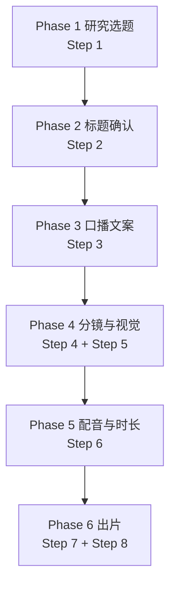
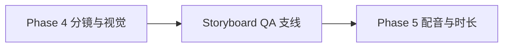

# 6步主链路与QA支线

## 外显 Phase 与内部 Step 对应

| Phase | 名称 | 内部 Step |
|---|---|---|
| 1 | 研究选题 | 1 |
| 2 | 标题确认 | 2 |
| 3 | 口播文案 | 3 |
| 4 | 分镜与视觉 | 4, 5 |
| 5 | 配音与时长 | 6 |
| 6 | 出片 | 7, 8 |

## 主链路



## QA 支线



## 每步输出

### Phase 1

- 输出：`analysis`
- 衍生：`researchFacts`、`topicResearch`

### Phase 2

- 输出：`titles.options[]`
- 关键字段：`selectedId`、`selectedReason`

### Phase 3

- 输出：`copy.brief`、`copy.outline[]`、`copy.body[]`、`copy.cta`
- 关键字段：`sceneIntent`、`evidenceAnchor`、`keywords`、`dataPoints`、`storySpine`

### Phase 4

- Step 4 输出：`shots[]`、`scenePlan`
- Step 5 输出：`prompts.byShotId[]`
- 关键字段：`sceneFamily`、`visualSystem`

### Phase 5

- 输出：`voice.script[]`
- 关键字段：`voice.engine`、`voice.language`、`voice.totalDuration`

### Phase 6

- Step 7 输出：`projectBuild`
- Step 8 输出：render props、最终导出路径

## Storyboard QA 支线特点

- 开关：`--with-storyboard-qa`
- 写入：`projects/<projectId>/qa/storyboard/`
- 不污染：`public/assets/`
- 不改写：`project.json imageUrl`
- 聚合：`server/workflow/phaseRegistry.js`

## 核心入口

- CLI：`scripts/run-search-to-ultimate.mjs`
- phase 聚合：`server/workflow/phaseRegistry.js`
- skill 合同：`server/workflow/skillRegistry.js`

## 快速管线（Fast Pipeline）

另有一条 3 步快速管线供轻量场景使用：[[17 Fast Pipeline 与架构变更]]

```bash
node scripts/fast-pipeline.mjs "你的主题"
```

- 3 次 LLM 调用（原 6+）
- 1-3 分钟出结果
- 自带缓存/resume
