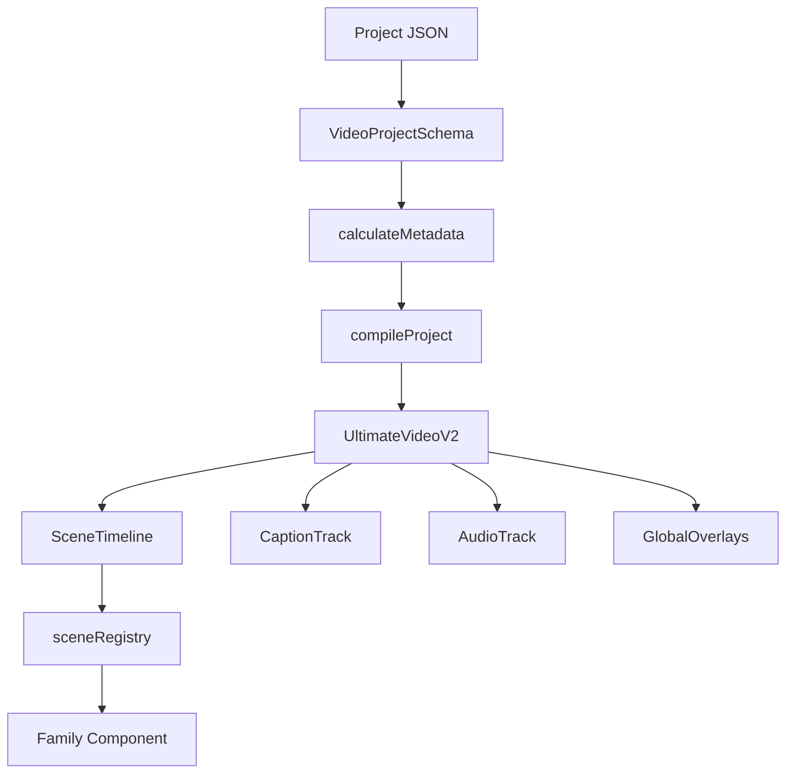

# V2 渲染架构

## 主链路



## 编译阶段

`calculateMetadata` 在 Remotion 确定 Composition 参数前调用 `compileProject`：

1. 校验 Project schema。
2. 校验 family 是否注册。
3. 使用 family 专属 schema 校验 payload。
4. 解析本地或远程资产。
5. 计算 Scene 总帧数。
6. 裁剪超出总时长的字幕。
7. 把编译结果传给 `UltimateVideoV2`。

编译阶段失败比渲染中间黑屏更可控。

## 四条时间线

### SceneTimeline

使用 `TransitionSeries` 排列 Scene。场景组件中的 `useCurrentFrame()` 返回 Scene 局部帧。

### CaptionTrack

- `boxed`：通用分页和词级高亮。
- `editorial`：逐条 Caption 渲染，适合连续中文口播。

### AudioTrack

voice 播放一次，music 可循环。所有路径由编译后的 Asset 决定。

### GlobalOverlays

显示可选项目角标。竖屏口播通常通过 `showProjectLabel: false` 关闭。

## Family 注册

`sceneRegistry.tsx` 同时负责：

- family 名称存在性
- payload schema
- family 到 React 组件映射
- accent 解析
- 本地图片 fallback

## 确定性规则

- 动画只由 `useCurrentFrame()` 驱动。
- 不使用 CSS animation、transition、`setTimeout()` 或随机数。
- 本地图片通过 `Img + staticFile()` 加载。
- 音视频通过 Remotion media 组件加载。
- 渲染期间不生成素材。

## 当前 skill-showcase 路径

```text
scene payload.beats
  -> SkillShowcase
  -> resolveSkillBeats
  -> SemanticBeatOverlay
  -> SemanticIcon + DeterministicMotionField
```

## 继续阅读

- Family：[[05 skill-showcase 场景族]]
- QA：[[06 QA 与调试]]
