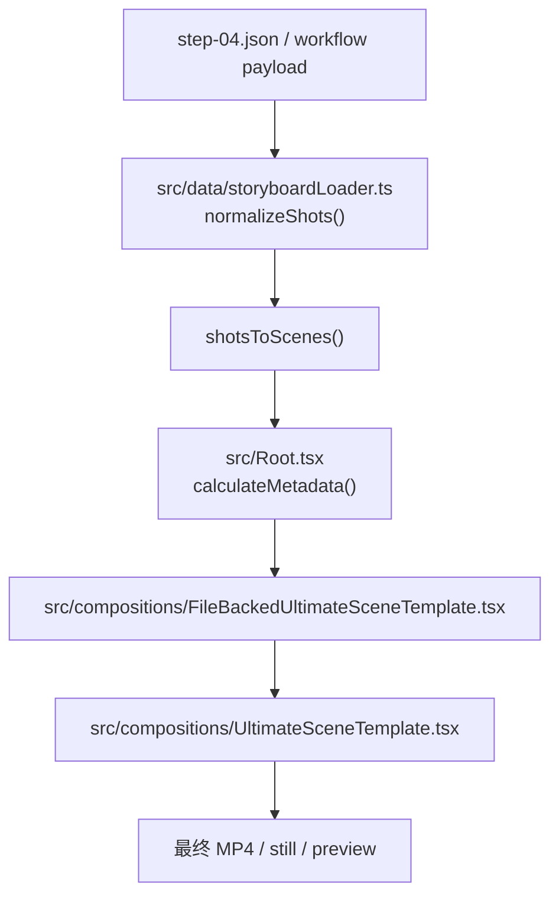
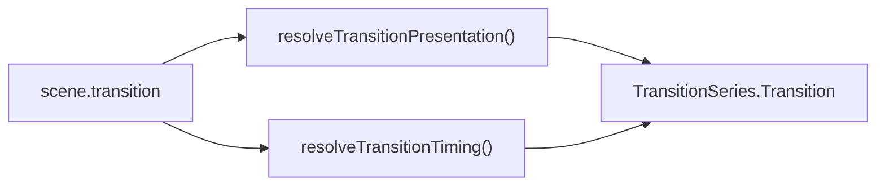
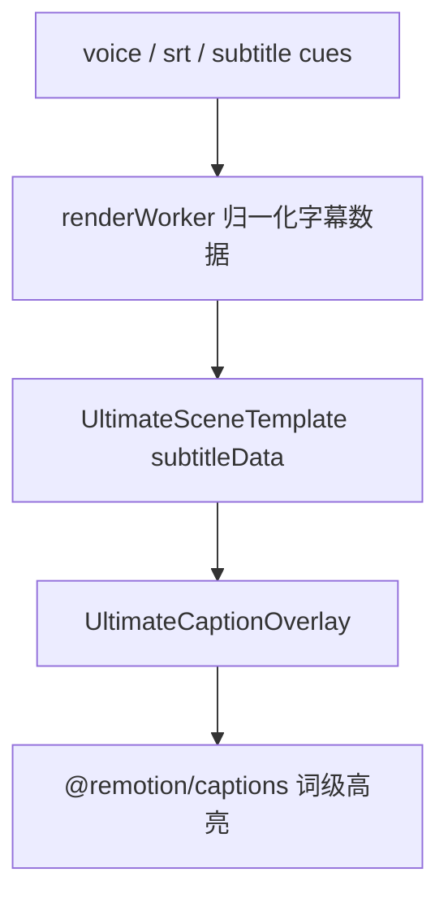

# 渲染链路

## 最关键的一句话

当前 Ultimate 渲染真源不是手写 demo，而是：

`step-04 / workflow payload -> storyboardLoader -> shotsToScenes -> Root.calculateMetadata -> UltimateSceneTemplate -> MP4`

## 核心链路图

## 关键文件职责

### `src/Root.tsx`

- 注册 `UltimateSceneTemplate` composition
- 支持 CLI `--props='{\"shots\": [...]}'`
- 在 `calculateMetadata()` 里用 `shotsToScenes()` 动态算总帧数

### `src/data/storyboardLoader.ts`

- 支持三种输入：
  - `step-04.json segments_meta`
  - `step-04.json payload.shots`
  - `workflow_*.json result.payload.shots`
- 负责：
  - 标准化 shots
  - 生成 family 对应 scene data
  - 注入 `grammar`
  - 计算 `transition`
  - 计算 `stageConfig`

### `src/data/registry.ts`

- Family 真源
- Timing 真源
- Transition 真源
- Stage shell 真源

### `src/compositions/UltimateSceneTemplate.tsx`

- 真正渲染每一个 scene
- 使用 `@remotion/transitions`
- 渲染音频、字幕、overlay、media、icon orbit、family component

## 转场链路

## 字幕链路

## 图像与媒体链路

- 图片生成：`scripts/generate-shot-images.mjs`
- Scene 媒体卡：`UltimateSceneTemplate.tsx`
- 资源最终落点：
  - `public/assets/<projectId>/images`
  - `public/assets/voice/<projectId>`
  - `public/assets/outputs/<projectId>`

## 你最该记住的调试入口

- `scripts/preview-quick.mjs`
- `scripts/render-ultimate-scene.mjs`
- `scripts/verify-render-output.mjs`
