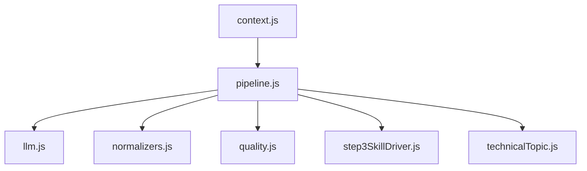
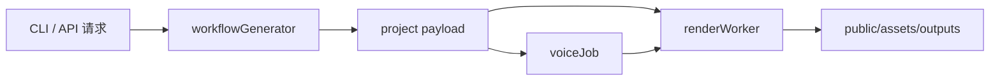

# 服务端与工作流

## server 分层

### `server/workflow/`

负责步骤生成、阶段聚合、Skill 合同、工作流产物。

关键文件：

- `workflowGenerator.js`
- `skillRegistry.js`
- `phaseRegistry.js`
- `workflowJobStore.js`
- `step123/`

### `server/voice/`

负责 `qwen-tts` 语音合成。

- `voiceJob.js`
- `qwenTtsClient.js`

### `server/workers/`

负责 render job 的实际执行。

- `renderWorker.js`

### `server/queue/`

负责任务排队。

- `fileQueue.js`
- `renderQueue.js`

### `server/api/`

负责 HTTP 接口。

- `api/server.js`

### `server/security/` 与 `server/validators/`

负责 webhook allowlist、projectId 合法性、public asset path 合法性等安全约束。

## Step 1-3 内核

## 核心职责

### `workflowGenerator.js`

- 主工作流入口
- 调度 step
- 组装 payload
- 和 CLI / worker 对接

### `skillRegistry.js`

- 定义每个 step 的 skill 来源、输入、输出、约束和质量规则
- 是 workflow 文档合同中心

### `phaseRegistry.js`

- 把内部 `step 1-8` 映射成对外 `phase 1-6`
- 定义 Storyboard QA 支线

## API / Render / Voice 的关系

## 关键限制

- 主语音链路已经收敛到 `qwen-tts`
- 渲染输入必须走安全验证
- workflow 文案和分镜字段必须与 Step 4/5 消费字段保持一致

## 产物路径与缓存

### projects — 项目工作态

`projects/<projectId>/` 保存 step 中间结果、音频、QA 分镜图。

### public/assets — 对外资源态

`public/assets/<projectId>/` 存放图片、字幕、语音、最终输出。

### runtime — 执行态

`runtime/` 存放 job 队列、日志、语音缓存、测试输出。

> **最容易混淆：** `projects/` ≠ `public/assets/` ≠ `runtime/`。三者分别是项目态、对外态、执行态。
