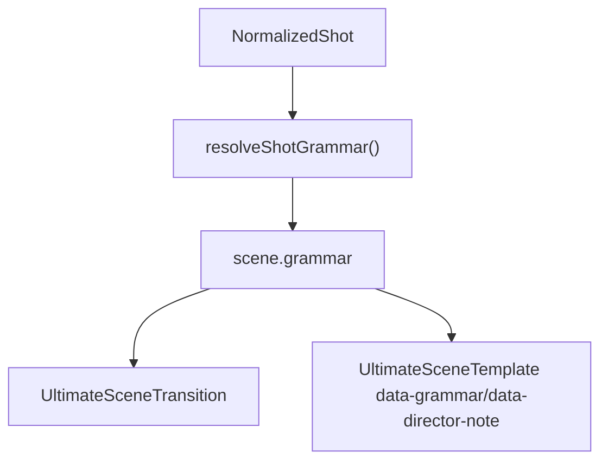

# 导演层与 Shot Grammar

## 目标

这层不是为了“多几个动画函数”，而是为了把系统从：

- family-first

升级到：

- director language -> shot grammar -> camera/data/memory -> family

## 真源文件

- `src/data/shotGrammar.ts`
- `src/components/ultimate-kit/UltimateSceneTransition.tsx`
- `src/data/storyboardLoader.ts`
- `src/components/ultimate-kit/project.ts`

## 当前导演层对象

### ShotArchetype

当前定义的 archetype 包括：

- `lock-on reveal`
- `pressure countdown`
- `overtake race`
- `evidence pin`
- `threshold breach`
- `aftershock hold`
- `follow focus`
- `compress compare`
- `drift reveal`
- `bullet train`
- `burst spread`
- `trace flow`

### DataEventVerb

- `count-up`
- `delta-hit`
- `overtake`
- `threshold-cross`
- `burst-spread`
- `trace-flow`
- `pin`
- `settle`
- `flash`
- `none`

### CameraIntent

- `pin`
- `compress`
- `chase`
- `drift`
- `confront`
- `linger`
- `reveal`
- `none`

### VisualMemoryObject

- `line`
- `block`
- `word`
- `node`
- `beam`
- `card`
- `ring`
- `axis`

## 当前接线状态

### 已接入

- `storyboardLoader.ts` 会调用 `resolveShotGrammar()`
- `shotsToScenes()` 会把 `grammar` 注入到 scene
- `UltimateSceneTransition.tsx` 会消费：
  - `grammar.cameraIntent`
  - `grammar.enterFrames`
  - `grammar.emphasisFrames`

### 还只是元数据

- `grammar.dataEvent`
- `grammar.staggerGap`
- `grammar.memoryObject`
- `grammar.directorNote`

这些目前主要挂在 scene metadata / DOM data attributes 上，还没有完全成为视觉控制主参数。

## 数据流

## 导演层最重要的认知

- `registry.ts` 决定 family 的基础语义
- `shotGrammar.ts` 尝试在 family 之上再加一层导演语义
- 但如果 director layer 不真正控制数字动画、入场节拍、dominant object，它就还是“注释系统”

## 现阶段建议

- 以后先查这个文件，再决定是改 family 还是改 director layer
- 如果你要升级“导演感”，优先改 `shotGrammar.ts` 和 `UltimateSceneTransition.tsx`

## 配套知识库

- Family 选型总表：[[11 Family视觉语法总表]]
- Family 分页：[[Families/00 总览]]
- 排障入口：[[09 调试手册]]
