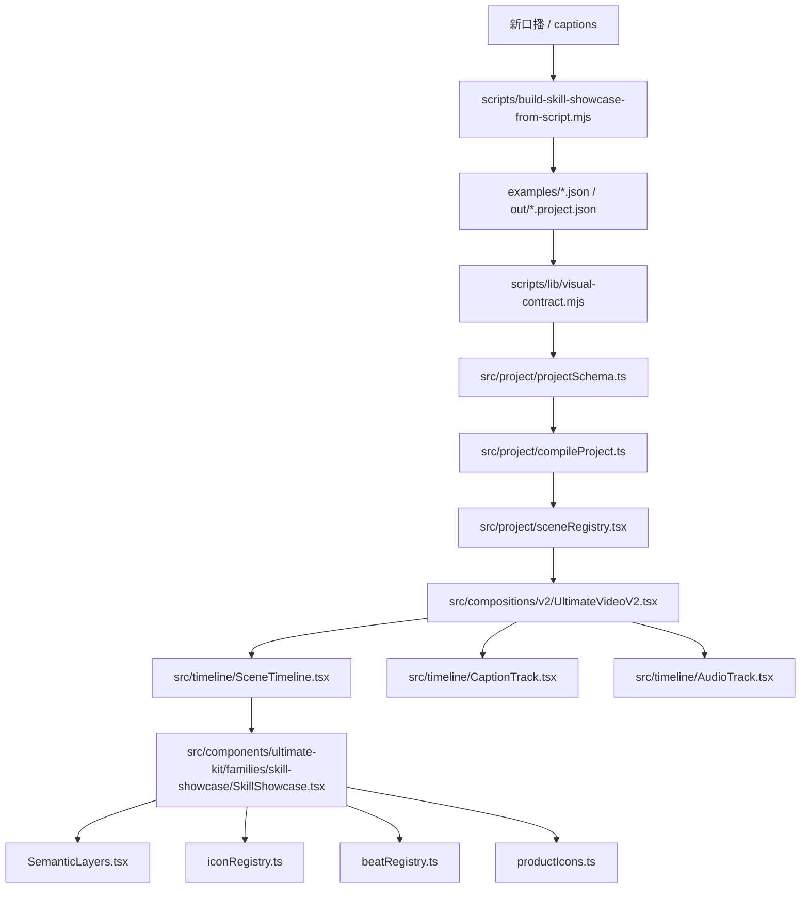

# 代码文件地图

## 核心路径

```text
/Users/macos/OpenClaw/remotion-generated-video-project/remotion-video
```

## 一图看懂



## 优先阅读顺序

1. `examples/skill-showcase.json`
2. `docs/skill-showcase-video.zh-CN.md`
3. `docs/development-code-constraints.zh-CN.md`
4. `src/project/projectSchema.ts`
5. `src/project/compileProject.ts`
6. `src/project/sceneRegistry.tsx`
7. `src/compositions/v2/UltimateVideoV2.tsx`
8. `src/components/ultimate-kit/families/skill-showcase/SkillShowcase.tsx`
9. `src/components/ultimate-kit/families/skill-showcase/SemanticLayers.tsx`
10. `scripts/check-skill-showcase-production.mjs`
11. `scripts/lib/visual-contract.mjs`
12. `scripts/build-skill-showcase-from-script.mjs`

## Swiss V5 技术镜头阅读顺序

如果要继续打磨“技术博主类真实讲解镜头”，不要从旧的 V3 主视觉开始改。优先按下面顺序看：

1. `examples/swiss-skill-spoken-v5-workbench.json`
2. `docs/technical-evidence-workbench-v2.zh-CN.md`
3. `src/components/ultimate-kit/families/skill-showcase/TechnicalEvidenceWorkbench.tsx`
4. `src/components/ultimate-kit/families/skill-showcase/PortraitCinematicSkillShowcase.tsx`
5. `src/components/ultimate-kit/families/skill-showcase/types.ts`
6. `src/project/sceneRegistry.tsx`
7. `scripts/build-swiss-skill-spoken-v5-workbench.mjs`
8. `scripts/lib/visual-contract.mjs`
9. `src/project/__tests__/swiss-skill-spoken-v5-workbench.test.ts`

V5 的正确理解方式：

```text
文案/字幕
  -> Beat（这一句在讲什么）
  -> Lens（应该用哪类技术镜头）
  -> Workbench Step（这一镜头里的证据、文件、日志、动作）
  -> TechnicalEvidenceWorkbench.tsx（真实画面组件）
  -> QA Sheet / Contact Sheet（人工检查 22 镜头是否重复）
```

## 文件职责

| 文件或目录 | 职责 | 改动风险 |
|---|---|---|
| `examples/skill-showcase.json` | 当前成品的章节、字幕、音频、Beat 和资产真源 | 高 |
| `examples/swiss-skill-spoken-v5-workbench.json` | Swiss V5 当前样片真源，包含 22 个技术镜头 step 和 lens | 高 |
| `src/project/projectSchema.ts` | Project 顶层合同、资产合同、字幕合同、Scene 合同 | 高 |
| `src/project/compileProject.ts` | 编译 Project，计算总帧数、校验 payload、解析资产 | 高 |
| `src/project/assetResolver.ts` | 本地和远程资产路径解析 | 中 |
| `src/project/sceneRegistry.tsx` | family 注册、payload schema、组件映射、accent fallback | 高 |
| `src/compositions/v2/UltimateVideoV2.tsx` | 主 Composition，接入 Scene、字幕、音频和全局叠层 | 高 |
| `src/timeline/SceneTimeline.tsx` | Scene 时间线和转场 | 中 |
| `src/timeline/CaptionTrack.tsx` | 字幕样式和时间轴 | 中 |
| `src/timeline/AudioTrack.tsx` | 语音与音乐 | 中 |
| `src/components/ultimate-kit/families/skill-showcase/SkillShowcase.tsx` | 固定样片变体、Design Skill 变体、`generic` 换稿变体和主体视觉 | 高 |
| `src/components/ultimate-kit/families/skill-showcase/PortraitCinematicSkillShowcase.tsx` | 竖屏电影化舞台；负责 Hero Visual 和字幕上方 Semantic Beat Animation 的空间分配 | 高 |
| `src/components/ultimate-kit/families/skill-showcase/TechnicalEvidenceWorkbench.tsx` | Swiss V5 技术镜头主渲染层；按 lens 输出 repo、扫描、管线、token、拓扑等真实技术讲解画面 | 高 |
| `src/components/ultimate-kit/families/skill-showcase/TechExplainerHero.tsx` | 技术解释 Hero 的旧/备用表达层，可作参考但不要让 V5 退化成单一模板 | 中 |
| `src/components/ultimate-kit/families/skill-showcase/SemanticLayers.tsx` | Beat、持续层、节拍层、转场层特效 | 高 |
| `src/components/ultimate-kit/families/skill-showcase/iconRegistry.ts` | 12 类图标包、76 个图标注册 | 中 |
| `src/components/ultimate-kit/families/skill-showcase/productIcons.ts` | 商品/Skill 彩色图标注册，换稿时必须优先扩展这里 | 中 |
| `src/components/ultimate-kit/families/skill-showcase/beatRegistry.ts` | 默认 Beat 和章节主图标 | 中 |
| `src/components/ultimate-kit/families/skill-showcase/types.ts` | Variant、Beat、Props、Hero Style、Technical Workbench Lens 类型 | 高 |
| `src/components/ultimate-kit/families/skill-showcase/storyboardContract.json` | 11 Motion + 9 Hero、画幅、审查帧、四层安全区和 Remotion-only 单一真源 | 高 |
| `src/compositions/RemotionStoryboardLibrary.tsx` | 20 个可复用组件的 Remotion 静帧目录 Composition | 高 |
| `scripts/check-skill-showcase-production.mjs` | 当前成品守门脚本 | 高 |
| `scripts/check-remotion-storyboard-contract.mjs` | 分镜目录合同和已渲染 PNG 守门入口 | 高 |
| `scripts/lib/storyboard-contract.mjs` | 分镜合同、区域、PNG 尺寸和哈希唯一性检查 | 高 |
| `scripts/render-remotion-storyboard-library.mjs` | 逐 index `selectComposition` 并用 `renderStill` 输出 20 张 PNG 与接触表 | 高 |
| `scripts/lib/visual-contract.mjs` | 换稿防污染守门；也负责 V5 workbench/lens/step 覆盖检查 | 高 |
| `scripts/build-skill-showcase-from-script.mjs` | 从新口播/captions 生成新 `skill-showcase` Project | 高 |
| `scripts/lib/script-project-generator.mjs` | scene 切分、关键词、图标、Beat 和 `sourceText` 的确定性生成器 | 高 |
| `scripts/build-swiss-skill-spoken-v5-workbench.mjs` | 生成 Swiss V5 workbench Project，维护 22 个语义镜头映射 | 高 |
| `scripts/build-swiss-v5-workbench-review.mjs` | 生成 V5 镜头审片项目，用于逐镜头 review | 中 |
| `src/project/__tests__/swiss-skill-spoken-v5-workbench.test.ts` | V5 技术镜头合同测试，检查 22 lens、step 覆盖和竖屏规格 | 高 |

## skill-showcase 目录

```text
src/components/ultimate-kit/families/skill-showcase/
  SkillShowcase.tsx
  SemanticLayers.tsx
  PortraitCinematicSkillShowcase.tsx
  TechnicalEvidenceWorkbench.tsx
  TechExplainerHero.tsx
  iconRegistry.ts
  beatRegistry.ts
  types.ts
```

## 改哪里

| 目标 | 第一改动位置 |
|---|---|
| 换一条新口播 | `project:from-script` 或 `production:build-project -- --family skill-showcase` |
| 改黄金样片口播节奏 | `examples/skill-showcase.json` |
| 改关键词入场 | `SemanticLayers.tsx` |
| 改章节主体画面 | `SkillShowcase.tsx` |
| 新增图标 | `iconRegistry.ts` 和 `public/projects/skill-showcase/icons/` |
| 新增商品/Skill 彩色图标 | `productIcons.ts` 和 `public/projects/skill-showcase/product-icons/` |
| 新增 Beat action | `types.ts`、`sceneRegistry.tsx`、`SemanticLayers.tsx` |
| 新增 Scene variant | `types.ts`、`sceneRegistry.tsx`、`SkillShowcase.tsx`、`examples/skill-showcase.json` |
| 改成品硬约束 | `scripts/check-skill-showcase-production.mjs` |
| 防止换稿旧画面污染 | `scripts/lib/visual-contract.mjs`、`project:visual-check`、`project:still`、`project:render` |
| 改 Swiss V5 22 个语义镜头内容 | `scripts/build-swiss-skill-spoken-v5-workbench.mjs` |
| 改 Swiss V5 某类 Lens 的真实画面 | `TechnicalEvidenceWorkbench.tsx` |
| 改主视觉和语义节拍之间的空间关系 | `PortraitCinematicSkillShowcase.tsx` |
| 增加新的技术 Lens 类型 | `types.ts`、`sceneRegistry.tsx`、`visual-contract.mjs`、`TechnicalEvidenceWorkbench.tsx`、V5 测试 |
| 检查 V5 是否重复 | `project:qa-sheet -- examples/swiss-skill-spoken-v5-workbench.json --out-dir out/swiss-v5-workbench --render --scale=0.35` |
| 检查 11+9 组件分镜链路 | `storyboard:check`、`storyboard:render`、`check-remotion-storyboard-contract.mjs --artifacts` |

## 不要改哪里

- 不要为了当前样片去重写通用 20+ family 模板。
- 不要把生成语音、搜索素材、截图浏览器塞进 Remotion runtime。
- 不要把绝对文件系统路径写进 `examples/skill-showcase.json`。
- 不要绕过 `sceneRegistry.tsx` 直接在 Composition 里 import family。

## 继续阅读

- 开发约束：[[07 开发代码约束]]
- 变更流程：[[12 变更 Playbook]]
