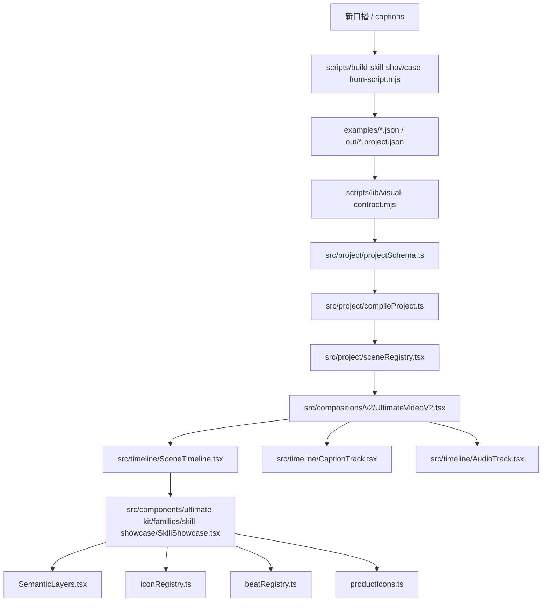

# 代码文件地图

## 核心路径

```text
/Users/macos/OpenClaw/remotion-generated-video-project/remotion-video
```

## 一图看懂



## 优先阅读顺序

1. `examples/skill-showcase.json`
2. `docs/skill-showcase-video.zh-CN.md`
3. `docs/development-code-constraints.zh-CN.md`
4. `src/project/projectSchema.ts`
5. `src/project/compileProject.ts`
6. `src/project/sceneRegistry.tsx`
7. `src/compositions/v2/UltimateVideoV2.tsx`
8. `src/components/ultimate-kit/families/skill-showcase/SkillShowcase.tsx`
9. `src/components/ultimate-kit/families/skill-showcase/SemanticLayers.tsx`
10. `scripts/check-skill-showcase-production.mjs`
11. `scripts/lib/visual-contract.mjs`
12. `scripts/build-skill-showcase-from-script.mjs`

## 文件职责

| 文件或目录 | 职责 | 改动风险 |
|---|---|---|
| `examples/skill-showcase.json` | 当前成品的章节、字幕、音频、Beat 和资产真源 | 高 |
| `src/project/projectSchema.ts` | Project 顶层合同、资产合同、字幕合同、Scene 合同 | 高 |
| `src/project/compileProject.ts` | 编译 Project，计算总帧数、校验 payload、解析资产 | 高 |
| `src/project/assetResolver.ts` | 本地和远程资产路径解析 | 中 |
| `src/project/sceneRegistry.tsx` | family 注册、payload schema、组件映射、accent fallback | 高 |
| `src/compositions/v2/UltimateVideoV2.tsx` | 主 Composition，接入 Scene、字幕、音频和全局叠层 | 高 |
| `src/timeline/SceneTimeline.tsx` | Scene 时间线和转场 | 中 |
| `src/timeline/CaptionTrack.tsx` | 字幕样式和时间轴 | 中 |
| `src/timeline/AudioTrack.tsx` | 语音与音乐 | 中 |
| `src/components/ultimate-kit/families/skill-showcase/SkillShowcase.tsx` | 固定样片变体、Design Skill 变体、`generic` 换稿变体和主体视觉 | 高 |
| `src/components/ultimate-kit/families/skill-showcase/SemanticLayers.tsx` | Beat、持续层、节拍层、转场层特效 | 高 |
| `src/components/ultimate-kit/families/skill-showcase/iconRegistry.ts` | 12 类图标包、76 个图标注册 | 中 |
| `src/components/ultimate-kit/families/skill-showcase/productIcons.ts` | 商品/Skill 彩色图标注册，换稿时必须优先扩展这里 | 中 |
| `src/components/ultimate-kit/families/skill-showcase/beatRegistry.ts` | 默认 Beat 和章节主图标 | 中 |
| `src/components/ultimate-kit/families/skill-showcase/types.ts` | Variant、Beat、Props 类型 | 高 |
| `scripts/check-skill-showcase-production.mjs` | 当前成品守门脚本 | 高 |
| `scripts/lib/visual-contract.mjs` | 换稿防污染守门，已接入 `project:check`、`project:still`、`project:render` | 高 |
| `scripts/build-skill-showcase-from-script.mjs` | 从新口播/captions 生成新 `skill-showcase` Project | 高 |
| `scripts/lib/script-project-generator.mjs` | scene 切分、关键词、图标、Beat 和 `sourceText` 的确定性生成器 | 高 |

## skill-showcase 目录

```text
src/components/ultimate-kit/families/skill-showcase/
  SkillShowcase.tsx
  SemanticLayers.tsx
  iconRegistry.ts
  beatRegistry.ts
  types.ts
```

## 改哪里

| 目标 | 第一改动位置 |
|---|---|
| 换一条新口播 | `project:from-script` 或 `production:build-project -- --family skill-showcase` |
| 改黄金样片口播节奏 | `examples/skill-showcase.json` |
| 改关键词入场 | `SemanticLayers.tsx` |
| 改章节主体画面 | `SkillShowcase.tsx` |
| 新增图标 | `iconRegistry.ts` 和 `public/projects/skill-showcase/icons/` |
| 新增商品/Skill 彩色图标 | `productIcons.ts` 和 `public/projects/skill-showcase/product-icons/` |
| 新增 Beat action | `types.ts`、`sceneRegistry.tsx`、`SemanticLayers.tsx` |
| 新增 Scene variant | `types.ts`、`sceneRegistry.tsx`、`SkillShowcase.tsx`、`examples/skill-showcase.json` |
| 改成品硬约束 | `scripts/check-skill-showcase-production.mjs` |
| 防止换稿旧画面污染 | `scripts/lib/visual-contract.mjs`、`project:visual-check`、`project:still`、`project:render` |

## 不要改哪里

- 不要为了当前样片去重写通用 20+ family 模板。
- 不要把生成语音、搜索素材、截图浏览器塞进 Remotion runtime。
- 不要把绝对文件系统路径写进 `examples/skill-showcase.json`。
- 不要绕过 `sceneRegistry.tsx` 直接在 Composition 里 import family。

## 继续阅读

- 开发约束：[[07 开发代码约束]]
- 变更流程：[[12 变更 Playbook]]
