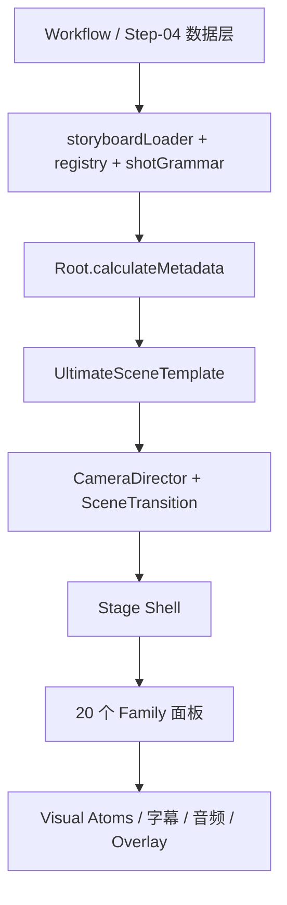

# 模块组件总表

## 目标

这页回答三个问题：

1. 现在这套 Remotion 系统到底分几层
2. 每一层有哪些核心组件
3. 出问题时应该先去哪个模块查

## 总体分层

## 1. 数据与编排层

| 模块                  | 位置                                     | 职责                              | 出问题先看什么                     |
| ------------------- | -------------------------------------- | ------------------------------- | --------------------------- |
| `phaseRegistry`     | `server/workflow/phaseRegistry.js`     | 把 8 个 step 聚合成 6 个 phase        | phase 展示与 QA 支线             |
| `skillRegistry`     | `server/workflow/skillRegistry.js`     | 管 step 输入输出合同                   | step 字段漂移                   |
| `workflowGenerator` | `server/workflow/workflowGenerator.js` | 主工作流调度                          | 为什么 step 没落盘                |
| `registry`          | `src/data/registry.ts`                 | family / timing / transition 真源 | family 默认时序不对               |
| `storyboardLoader`  | `src/data/storyboardLoader.ts`         | Step-04 转 scenes                | family、frames、visualProps 错 |
| `shotGrammar`       | `src/data/shotGrammar.ts`              | 导演语义层                           | 镜头意图、memory object          |

## 2. 渲染入口层

| 模块 | 位置 | 职责 | 备注 |
|---|---|---|---|
| `Root.tsx` | `src/Root.tsx` | 注册 composition，`calculateMetadata()` 动态算总帧数 | props.shots 真正进入口 |
| `OpenClawVideo.tsx` | `src/OpenClawVideo.tsx` | 老路径兼容 | 不是 Ultimate 真源 |
| `UltimateSceneTemplate` | `src/compositions/UltimateSceneTemplate.tsx` | 最终场景渲染容器 | 真正出片核心 |
| `FileBackedUltimateSceneTemplate` | `src/compositions/FileBackedUltimateSceneTemplate.tsx` | 文件驱动场景包装层 | CLI / render props 常用 |
| `UltimateElementsLibrary` | `src/compositions/UltimateElementsLibrary.tsx` | 元素库工作台 / 风格展示 | 做组件浏览很有用 |

## 3. 导演与镜头层

| 模块 | 位置 | 职责 | 关键控制项 |
|---|---|---|---|
| `CameraDirector` | `src/components/camera/CameraDirector.tsx` | 导演级 camera motion 包裹层 | `push-in` `pan-x` `drift` |
| `UltimateSceneTransition` | `src/components/ultimate-kit/UltimateSceneTransition.tsx` | 场景内节拍与转场外壳 | `enterFrames` `emphasisFrames` |
| `motion.ts` | `src/components/ultimate-kit/motion.ts` | spring/easing 基础实现 | 元件级微动效 |
| `motionGrammar.ts` | `src/components/ultimate-kit/motionGrammar.ts` | motion 语义预设 | director layer 待持续接入 |
| `shotArchetypes.ts` | `src/components/ultimate-kit/shotArchetypes.ts` | archetype 数据 | 辅助导演语义 |

## 4. 舞台外壳层

| 模块 | 位置 | 职责 | 说明 |
|---|---|---|---|
| `UltimateStage` | `src/components/ultimate-kit/families/UltimateStage.tsx` | 场景舞台基底 | 承担统一舞台感 |
| `UltimateBackdrop` | `src/components/ultimate-kit/families/UltimateBackdrop.tsx` | 背景和氛围 | family 常共享 |
| `UltimatePlatformOverlay` | `src/components/ultimate-kit/families/UltimatePlatformOverlay.tsx` | 平台壳与 HUD 感 | 可由 `stageConfig` 关闭 |
| `UltimateSubtitleBar` | `src/components/ultimate-kit/families/UltimateSubtitleBar.tsx` | 字幕底条 | 底部信息感 |
| `UltimateCaptionOverlay` | `src/components/ultimate-kit/UltimateCaptionOverlay.tsx` | 词级高亮字幕 | `@remotion/captions` 相关 |
| `ParticleBackground` | `src/components/ultimate-kit/ParticleBackground.ts` | 粒子背景支持 | 背景气氛层 |
| `iconography.ts` | `src/components/ultimate-kit/iconography.ts` | 图标和符号映射 | icon 命中相关 |

## 5. 20 个 Family 面板

### 锚点聚焦区

- `UltimateHeroPanel.tsx` -> `hero`
- `UltimateFocusDiagram.tsx` -> `focus`
- `UltimateQuoteHighlight.tsx` -> `quote-highlight`
- `UltimateGlossaryTerm.tsx` -> `glossary-term`
- `UltimateCtaPanel.tsx` -> `cta`

示意：

![[hero.png|420]]
![[focus.png|420]]

### 叙事表达区

- `UltimateFeatureCardRail.tsx` -> `feature-rail`
- `UltimateNumberStrip.tsx` -> `number-strip`
- `UltimateStepFlow.tsx` -> `step-flow`
- `UltimateTimeline.tsx` -> `timeline`
- `UltimateCompareBoard.tsx` -> `compare-board`

示意：

![[feature-rail.png|420]]
![[compare-board.png|420]]

### 系统证据区

- `UltimateTerminalPanel.tsx` -> `terminal`
- `UltimateEvidenceWall.tsx` -> `evidence-wall`
- `UltimateArchitectureMap.tsx` -> `architecture-map`
- `UltimateMemoryGraph.tsx` -> `memory-graph`
- `UltimatePipelineFlow.tsx` -> `pipeline-flow`

示意：

![[terminal.png|420]]
![[architecture-map.png|420]]

### 数据摘要区

- `UltimateTagMatrix.tsx` -> `tag-matrix`
- `UltimateMetricBars.tsx` -> `metrics`
- `UltimateDataStream.tsx` -> `data-stream`
- `UltimateBenchmarkChart.tsx` -> `benchmark-chart`
- `UltimateCodePanel.tsx` -> `code`

示意：

![[data-stream.png|420]]
![[benchmark-chart.png|420]]

## 从画面反查组件

### 锚点聚焦区

| Family | React 组件 | 最先喂什么字段 | 详情 | 图 |
|---|---|---|---|---|
| `hero` | `UltimateHeroPanel.tsx` | `title` + `visual.props.lines` | [[Families/hero]] | [[14 图片图库#hero]] |
| `focus` | `UltimateFocusDiagram.tsx` | `visual.props.keyword` + `description` | [[Families/focus]] | [[14 图片图库#focus]] |
| `quote-highlight` | `UltimateQuoteHighlight.tsx` | `narration` + `visual.props.attribution` | [[Families/quote-highlight]] | [[14 图片图库#quote-highlight]] |
| `glossary-term` | `UltimateGlossaryTerm.tsx` | `visual.props.term` + `narration` | [[Families/glossary-term]] | [[14 图片图库#glossary-term]] |
| `cta` | `UltimateCtaPanel.tsx` | `title` + `narration` | [[Families/cta]] | [[14 图片图库#cta]] |

### 叙事表达区

| Family | React 组件 | 最先喂什么字段 | 详情 | 图 |
|---|---|---|---|---|
| `feature-rail` | `UltimateFeatureCardRail.tsx` | `features[]` | [[Families/feature-rail]] | [[14 图片图库#feature-rail]] |
| `number-strip` | `UltimateNumberStrip.tsx` | `visual.props.count` + `items[]` | [[Families/number-strip]] | [[14 图片图库#number-strip]] |
| `step-flow` | `UltimateStepFlow.tsx` | `items[]` | [[Families/step-flow]] | [[14 图片图库#step-flow]] |
| `timeline` | `UltimateTimeline.tsx` | `items[]` | [[Families/timeline]] | [[14 图片图库#timeline]] |
| `compare-board` | `UltimateCompareBoard.tsx` | `comparisons[]` + `dataPoints[]` | [[Families/compare-board]] | [[14 图片图库#compare-board]] |

### 系统证据区

| Family | React 组件 | 最先喂什么字段 | 详情 | 图 |
|---|---|---|---|---|
| `terminal` | `UltimateTerminalPanel.tsx` | `visual.props.command` + `outputs[]` | [[Families/terminal]] | [[14 图片图库#terminal]] |
| `evidence-wall` | `UltimateEvidenceWall.tsx` | `comparisons[]` | [[Families/evidence-wall]] | [[14 图片图库#evidence-wall]] |
| `architecture-map` | `UltimateArchitectureMap.tsx` | `items[]` + `visual.props.centerTitle` | [[Families/architecture-map]] | [[14 图片图库#architecture-map]] |
| `memory-graph` | `UltimateMemoryGraph.tsx` | `items[]` + `centerTitle` | [[Families/memory-graph]] | [[14 图片图库#memory-graph]] |
| `pipeline-flow` | `UltimatePipelineFlow.tsx` | `items[]` | [[Families/pipeline-flow]] | [[14 图片图库#pipeline-flow]] |

### 数据摘要区

| Family | React 组件 | 最先喂什么字段 | 详情 | 图 |
|---|---|---|---|---|
| `tag-matrix` | `UltimateTagMatrix.tsx` | `visual.props.tabs` + `items[]` | [[Families/tag-matrix]] | [[14 图片图库#tag-matrix]] |
| `metrics` | `UltimateMetricBars.tsx` | `dataPoints[]` 形如 `标签:值:ratio` | [[Families/metrics]] | [[14 图片图库#metrics]] |
| `data-stream` | `UltimateDataStream.tsx` | `dataPoints[]` 形如 `标签:值` | [[Families/data-stream]] | [[14 图片图库#data-stream]] |
| `benchmark-chart` | `UltimateBenchmarkChart.tsx` | `dataPoints[]` 形如 `标签:主值:副值:ratio` | [[Families/benchmark-chart]] | [[14 图片图库#benchmark-chart]] |
| `code` | `UltimateCodePanel.tsx` | `visual.props.lines[]` | [[Families/code]] | [[14 图片图库#code]] |

## 6. 视觉原子层

视觉原子是 family 可复用的视觉零件。完整列表见 [[04 渲染链路#图像与媒体链路]]。

当前主要原子：`TextMaskWipe`、`GodRays`、`DotGridParallax`、`ParticleBackground`、`ProgressRing`、`MiniChart`。

## 7. 类型与合同层

| 模块 | 位置 | 职责 |
|---|---|---|
| `project.ts` | `src/components/ultimate-kit/project.ts` | family 枚举、scene config、transition 类型 |
| `types.ts` | `src/components/ultimate-kit/types.ts` | family data props 类型 |
| `tokens.ts` | `src/components/ultimate-kit/tokens.ts` | 视觉 token |

> 排障请直接看 [[09 调试手册#症状速查]]。

## 相关入口

- 选 family：[[11 Family视觉语法总表]]
- 看命中：[[13 命中规则与抢占地图]]
- 看图：[[14 图片图库]]
- 看单个 family：[[Families/00 总览]]
