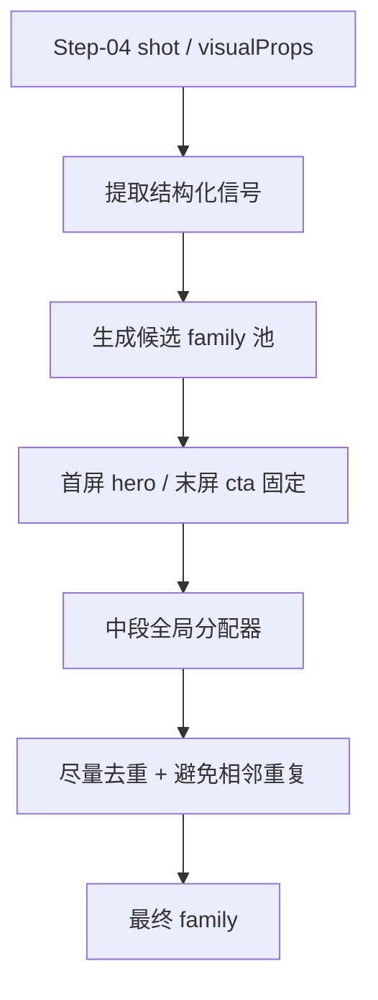

# 命中规则与抢占地图

## 一句话结论

这套系统现在不是“单镜头看到什么就立刻定什么”，而是：

1. 首尾锚点固定
2. 中段先拿候选模板
3. 再按整条视频级别做全局分配
4. 尽量减少中段重复和相邻重复

真源：

- `remotion-video/scripts/lib/ultimate-project-adapter.js`
- `remotion-video/docs/ultimate-elements-atlas.zh-CN.md`

## 命中总流程

## 固定命中

- 第一屏固定 `hero`
- 最后一屏固定 `cta`

所以中段 family 竞争只发生在中间镜头。

## 当前中段优先级

根据当前 atlas 和 registry 认知，最值得记住的是这一条顺序：

1. `terminal`
2. `data-stream`
3. `benchmark-chart`
4. `timeline`
5. `compare-board`
6. `number-strip`
7. `evidence-wall`
8. `code`
9. `memory-graph`
10. `architecture-map`
11. `pipeline-flow`
12. `step-flow`
13. `glossary-term`
14. `feature-rail`
15. `metrics`
16. `tag-matrix`
17. `quote-highlight`
18. `focus`

白话理解：

- 越靠前，越容易抢走别人
- 越靠后，越需要你手动指定或喂更强结构数据

## 强触发信号表

| Family | 最强触发信号 | 最稳控制方式 |
|---|---|---|
| `hero` | 第一屏 | 放第一屏或手写 `family` |
| `cta` | 最后一屏 | 放最后一屏或手写 `family` |
| `terminal` | `terminal` `cli` `bash` `render` `日志` `命令` | 保留终端词 |
| `data-stream` | `实时` `stream` `吞吐` `qps` `tokens/s` | 给实时指标 |
| `benchmark-chart` | `benchmark` `跑分` `bench` `性能对打` | 给 2-3 组对照数值 |
| `timeline` | `发布` `前脚` `后脚` `里程碑` `roadmap` | 给 3-4 个节点 |
| `compare-board` | `comparisons` `旧讲法 vs 当前方案` | 直接给 left/right |
| `number-strip` | `很多人以为` `不是…而是…` | 写成反转句式 |
| `evidence-wall` | `官方` `GitHub` `论文` `docs` `证据` | 给来源型 facts |
| `code` | `json` `schema` `api` `参数` `配置` | 明确结构化代码内容 |
| `memory-graph` | `memory` `context` `graph` `检索` | 给关系节点 |
| `architecture-map` | `架构` `系统` `模块` `agent` | 给模块拓扑 |
| `pipeline-flow` | `pipeline` `flow` `链路` `process` | 给阶段链 |
| `step-flow` | `第一` `第二` `先` `再` `最后` | 明确 3 步以上 |
| `feature-rail` | `场景` `团队` `痛点` `案例` | 给 3-4 张卡 |
| `metrics` | 至少 2 个数字 token | 让文案尽量纯指标化 |
| `tag-matrix` | `keywords + dataPoints >= 5` | 提供足够多标签项 |
| `quote-highlight` | `关键判断` `一句话结论` | 直接给短金句 |
| `focus` | 很短且聚焦的 `visualFocus` | 手写 `family: "focus"` |
| `glossary-term` | `是什么` `本质上` `术语定义` | term + definition |

## 最常见的“抢走”关系

| 你以为会命中 | 实际常被谁抢走 | 为什么 |
|---|---|---|
| `feature-rail` | `number-strip` / `compare-board` / `code` | 文案里混进了反转、对比、JSON 信号 |
| `metrics` | `benchmark-chart` / `timeline` / `data-stream` | 指标语义不够纯，被更强数据结构抢走 |
| `focus` | 几乎所有前排 family | 它优先级靠后，最适合手写 |
| `step-flow` | `pipeline-flow` / `terminal` / `code` | 你写成了工程链路或命令现场 |
| `architecture-map` | `memory-graph` / `pipeline-flow` | 文案没分清结构、关系、过程 |
| `quote-highlight` | `focus` / `glossary-term` 或直接不进 | 句子不够短，不够像“结论锤” |

## 你真正能控的 4 个杠杆

### 1. 直接写 `family`

最强，优先级最高。

### 2. 喂结构化字段

- `compare-board` 给 `comparisons`
- `timeline` 给节点
- `architecture-map` 给 `nodes`
- `pipeline-flow` 给 `stages`
- `benchmark-chart` 给对照数值

### 3. 删掉会误导的强信号词

比如你想要 `feature-rail`，就不要又写：

- `benchmark`
- `json`
- `render log`
- `不是…而是…`

### 4. 从整条片子角度配额

短视频里重点不是把 20 个 family 都用上，而是让中段别老重复。

## 6 到 8 场景的推荐配额

- `1` 个 `hero`
- `4-6` 个中段不同 family
- `1` 个 `cta`

## 9 到 12 场景的推荐配额

- `1` 个 `hero`
- `6-8` 个中段不同 family
- `1` 个 `cta`
- 允许少量复用，但不要连续复用

## 看图辅助判断

- family 画面总览：[[16 图片图库]]
- family 语义总表：[[13 Family视觉语法总表]]
- family 逐页说明：[[Families/00 总览]]
