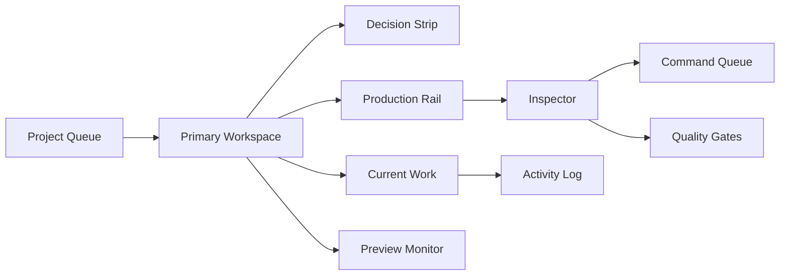

# Video Factory Console 重新设计开发规格书

版本：2026-07-17

适用范围：`remotion-video/src/tools/VideoFactoryConsole.tsx` 与 `remotion-video/src/tools/global.css`

## 0. 结论

当前界面失败的根因不是“不够好看”，而是没有形成产品闭环。用户打开页面后不知道：

1. 这是什么工具。
2. 当前该先点哪里。
3. 点击之后状态如何变化。
4. 如何从一个项目推进到可渲染成片。

下一版必须从“展示型 dashboard”重构为“可操作的视频生产控制台”。界面必须让用户不读说明也能完成一条最小路径：

选择项目 → 选择生产节点 → 处理当前任务 → 运行命令 → 查看反馈 → 进入下一节点。

## 1. 参考来源与取法

按 GitHub star 量级选取前三个 UI/design 参考，不照搬组件库，只抽取方法论。

| 排名 | 项目 | GitHub | 使用方法论 |
| --- | --- | --- | --- |
| 1 | shadcn/ui | https://github.com/shadcn-ui/ui | 可复制、可组合、状态清楚的组件单元。每个 UI 块都应该能独立表达用途，不靠外部说明。 |
| 2 | Ant Design | https://github.com/ant-design/ant-design | 企业级任务流、表单、反馈、状态和操作路径。复杂流程必须有明确主操作、次操作和反馈区。 |
| 3 | Material UI | https://github.com/mui/material-ui | 可访问性、可预期交互、响应式约束和组件状态。所有控件要有明确 hover、disabled、active、loading 语义。 |

本项目不直接引入这些库，原因：

- 当前工具页已经是轻量 Vite + React。
- 引入大型 UI 库会扩大依赖和视觉冲突。
- 我们需要的是方法论，不是套皮。

## 2. 设计规格

### 2.1 Purpose Statement

Video Factory Console 是一个视频生产操作台，用于把上游生产合同从 `Topic Brief` 推进到 `Project JSON`，再进入 Still、MP4 和 Render QA。目标用户是内容生产者、开发者和自动化视频流水线维护者。他们不是来欣赏界面的，而是来判断“后端链路卡在哪里、下一步该运行哪个脚本、执行后有没有成功”。

### 2.2 Aesthetic Direction

Industrial / utilitarian。

关键词：

- 制片室
- 工具台
- 状态明确
- 密度可控
- 操作反馈强

不做：

- 营销型 hero
- 模糊酷炫背景
- 大量卡片堆叠
- 没有状态反馈的假按钮

### 2.3 Color Palette

| Token | Hex | 用途 |
| --- | --- | --- |
| `--bg` | `#090B0D` | 页面背景 |
| `--panel` | `#101315` | 面板底色 |
| `--text` | `#F2F5F4` | 主文本 |
| `--muted` | `#9AA4A7` | 次级文本 |
| `--accent` | `#75D6C7` | 当前节点、可执行动作、通过状态 |
| `--warning` | `#E8BC5D` | 待处理、警告 |
| `--danger` | `#EC6F82` | 阻塞、失败 |
| `--success` | `#8BD89A` | 已完成、通过 |

禁止：

- 紫色、蓝紫、靛蓝、洋红渐变。
- 多主色并列。
- 为装饰而使用发光和大面积渐变。

### 2.4 Typography

当前实现可继续用系统字体，但下一轮视觉升级建议替换为：

- Display：`IBM Plex Sans Condensed`
- Body：`IBM Plex Sans`
- Mono：`IBM Plex Mono`

字号规范：

| 层级 | 尺寸 | 用途 |
| --- | --- | --- |
| H1 | 28-34px | 当前项目标题 |
| Section | 13-15px | 面板标题 |
| Row title | 13-15px | 任务、命令、节点 |
| Meta | 11-12px | 状态、时间、规格 |
| Mono | 10-11px | 命令行 |

规则：

- 不用 viewport 直接缩放字体。
- 中文标题不能孤字换行。
- 命令行允许单行截断，但必须有运行反馈。

### 2.5 Layout Strategy

桌面端采用三域工作台：

1. 左侧：Project Queue。
2. 中间：Primary Workspace。
3. 右侧：Inspector。

移动端采用单列任务流：

1. 当前项目。
2. 当前卡点。
3. 生产节点。
4. 当前工作。
5. 预览监视器。
6. 质量闸门。
7. 命令队列。
8. Activity Log。

## 3. 产品使用路径

### 3.1 第一次打开页面

用户必须在第一屏看到：

- 当前项目标题。
- 当前卡点。
- 下一步。
- 主要风险。
- 主操作按钮。
- 生产流程节点。

第一屏不能出现：

- 组件库。
- 模板库。
- 装饰性统计。
- 长篇说明文字。

### 3.2 最小可用路径

1. 用户在左侧选择项目。
2. 中间标题和卡点同步变化。
3. 用户点击生产节点。
4. 当前工作、预览、质量闸门、命令队列同步变化。
5. 用户点击任务行的操作按钮。
6. 任务状态变化，并写入 Activity Log。
7. 用户点击命令的 Run。
8. 命令状态变为 Running。
9. 运行完成后变为 Done。
10. Activity Log 记录命令完成。

这条路径必须不依赖文档解释。

## 4. 信息架构



## 5. 数据合同

### 5.1 Project

```ts
type Project = {
  id: string;
  title: string;
  format: string;
  duration: string;
  owner: string;
  progress: number;
  blockers: number;
  currentNodeId: string;
  nodes: ProductionNode[];
};
```

### 5.2 ProductionNode

```ts
type ProductionNode = {
  id: string;
  label: string;
  state: 'done' | 'current' | 'waiting';
  summary: string;
  owner: string;
  next: string;
  risk: string;
  work: WorkItem[];
  gates: QualityGate[];
  commands: Command[];
  preview: PreviewSignal;
};
```

### 5.3 WorkItem

```ts
type WorkItem = {
  id: string;
  label: string;
  meta: string;
  state: 'pass' | 'warn' | 'fail';
  actionLabel: string;
};
```

### 5.4 Command

```ts
type Command = {
  id: string;
  label: string;
  command: string;
  defaultState: 'ready' | 'queued' | 'running' | 'done';
};
```

### 5.5 ActivityEvent

```ts
type ActivityEvent = {
  id: string;
  time: string;
  label: string;
  detail: string;
  tone: 'info' | 'success' | 'warning' | 'danger';
};
```

## 6. 状态机

## 6A. 后端链路映射

前端不能发明后端不存在的节点或参数。当前仓库真实链路如下：

```text
production:scaffold
  -> production:check
  -> production:build-project
  -> project:check
  -> project:still
  -> project:render
  -> project:verify
```

实际主线：

```text
Topic Brief -> Script Pack -> Asset Pack -> Project JSON -> Still -> Render QA
```

渲染主线：

```text
Project JSON -> compileProject() -> UltimateVideoV2 -> PNG / MP4
```

前端节点到脚本映射：

| 前端节点 | 后端产物 | 可运行脚本 | 参数约束 |
| --- | --- | --- | --- |
| `Topic Brief` | `brief.json`、`sources.md`、目录结构 | `npm run production:scaffold -- "标题" --link <url> --id <projectId>` | `scaffold-production.mjs` 支持 `--title`、`--link`、`--id`、`--out`，不支持 `--node` |
| `Script Pack` | `script-pack.json` | `npm run production:check -- <production-dir>` | 只接收生产目录 |
| `Asset Pack` | `asset-pack.json`、`public/projects/<id>/...` | `npm run production:check -- <production-dir>` | 只接收生产目录 |
| `Project JSON` | `project.json` | `npm run production:build-project -- <production-dir>`；`npm run project:check -- <project.json>` | `build-project` 输出 `project.json`；`project:check` 只接收 project JSON |
| `Still` | Still PNG | `npm run project:still -- <project.json> --frame 30` | 支持 `--frame`、`--out` |
| `Render QA` | MP4 + ffprobe 验收 | `npm run project:render -- <project.json> --out <mp4>`；`npm run project:verify -- --props <project.json> --video <mp4>` | `verify-project-render.mjs` 需要 `--props` 和 `--video` |

禁止：

- 前端命令中出现脚本不支持的 `--node`。
- 前端节点直接暗示搜索、LLM、截图、TTS 或队列服务会在 Remotion 运行时发生。
- 把 `Project JSON` 之前的生产合同和 Remotion 主链路混成同一个状态。

### 6.1 节点状态

| 状态 | 含义 | UI 表现 |
| --- | --- | --- |
| `done` | 已完成 | 低对比绿色编号 |
| `current` | 当前卡点 | 强边框、强调色编号 |
| `waiting` | 等待前置条件 | 降低透明度 |

### 6.2 任务状态

| 状态 | 含义 | 可操作 |
| --- | --- | --- |
| `pass` | 已通过 | 可重开 |
| `warn` | 待处理 | 可标记完成 |
| `fail` | 阻塞 | 可标记完成 |

### 6.3 命令状态

| 状态 | 含义 | 按钮 |
| --- | --- | --- |
| `ready` | 可以执行 | Run |
| `queued` | 排队等待 | Queue，可点击运行 |
| `running` | 正在运行 | Running，disabled |
| `done` | 已完成 | Done，disabled |

命令运行时必须写入 Activity Log。

## 7. 核心组件规格

### 7.1 Project Queue

目的：选择当前生产项目。

必须显示：

- 当前节点。
- 项目标题。
- 视频类型 / 时长 / blocker 数。
- 进度条。

交互：

- 点击项目后切换 `selectedProjectId`。
- 同时将 `selectedNodeId` 重置为项目的 `currentNodeId`。
- Activity Log 写入“切换项目”。

### 7.2 Decision Strip

目的：让用户一眼知道当前任务。

四个槽位：

1. 当前卡点。
2. 下一步。
3. 主要风险。
4. 进度。

禁止放：

- 模糊指标。
- 装饰性数字。
- 不可操作的状态文案。

### 7.3 Production Rail

目的：选择生产节点。

节点必须严格对应后端真实链路：

1. `Topic Brief`：`brief.json`、`sources.md`、生产目录。
2. `Script Pack`：`script-pack.json`、观点、口播稿。
3. `Asset Pack`：`asset-pack.json`、素材缺口、fallback。
4. `Project JSON`：`production:build-project` 与 `project:check`。
5. `Still`：`project:still` 和人工画面确认。
6. `Render QA`：`project:render` 与 `project:verify`。

交互：

- 点击节点后同步：
  - Current Work
  - Preview Monitor
  - Quality Gates
  - Command Queue
  - Node Context

### 7.4 Current Work

目的：列出当前节点需要处理的任务。

每行必须包含：

- 状态标签。
- 任务标题。
- 任务补充信息。
- 操作按钮。

按钮行为：

- `warn/fail` → 点击后变 `pass`。
- `pass` → 点击后变 `warn`。
- 每次变化写入 Activity Log。

### 7.5 Preview Monitor

目的：确认当前节点对应的画面风险。

必须显示：

- 当前帧。
- 输出规格。
- 安全区。
- 字幕区。
- 预览状态信号。

交互：

- 节点切换时预览内容必须变化。
- Still 节点显示 Still 检查语言。
- Render QA 节点显示 MP4 渲染与 ffprobe 验收语言。

### 7.6 Command Queue

目的：运行当前节点命令。

每行必须显示：

- 命令名称。
- 命令文本。
- 状态按钮。

交互：

- 点击 Run / Queue 后变 Running。
- 700ms 后变 Done。
- Activity Log 写入开始和完成。

### 7.7 Quality Gates

目的：展示当前节点是否可继续。

必须按当前节点动态变化。

规则：

- 有 `fail` 时主操作按钮应进入受限态。
- 有 `warn` 时主操作仍可运行，但要显示 warnings 数。
- 全部 `pass` 时显示 ready。

### 7.8 Activity Log

目的：解决“点了没反应”的问题。

必须记录：

- 切换项目。
- 切换节点。
- 标记任务。
- 运行命令。
- 命令完成。

展示方式：

- 桌面端放 Inspector 第三段。
- 移动端放 Command Queue 后。

## 8. 页面结构

### 8.1 桌面端

```text
┌───────────────┬──────────────────────────────────────┬──────────────────┐
│ Project Queue │ Topbar                               │ Command Queue    │
│               ├──────────────────────────────────────┤                  │
│               │ Decision Strip                       ├──────────────────┤
│               ├──────────────────────────────────────┤ Quality Gates    │
│               │ Production Rail                      ├──────────────────┤
│               ├──────────────────┬───────────────────┤ Activity Log     │
│               │ Current Work     │ Preview Monitor   │                  │
└───────────────┴──────────────────┴───────────────────┴──────────────────┘
```

### 8.2 移动端

```text
Topbar
Decision Strip
Production Rail
Current Work
Preview Monitor
Quality Gates
Command Queue
Activity Log
```

移动端不显示左侧 Project Queue。项目切换可以下一阶段做为顶部 select 或 drawer，但本轮重点是当前项目可操作闭环。

## 9. 可用性原则

1. 所有按钮点击后必须有状态变化。
2. 所有状态变化必须写入 Activity Log。
3. 所有节点切换必须让至少三个区域变化。
4. 主操作按钮不能是装饰，必须触发当前节点第一条命令。
5. 任务列表不能只是展示，必须可标记。
6. 移动端不能丢失桌面端核心功能。

## 10. 文案规范

UI 文案使用操作语言：

- 好：`标记完成`
- 好：`运行当前命令`
- 好：`Quality Gates`
- 好：`Command Queue`
- 差：`智能生产中枢`
- 差：`一站式创作体验`
- 差：`释放视频生产力`

## 11. 实现任务

### Phase 1：交互闭环

- [ ] 给 WorkItem 增加操作按钮。
- [ ] 增加 `workItemOverrides` 状态。
- [ ] 点击任务按钮后切换任务状态。
- [ ] 增加 Activity Log。
- [ ] 点击项目、节点、任务、命令都写入日志。
- [ ] 主操作按钮运行当前节点第一条命令。

### Phase 2：移动端完整产品

- [ ] 移动端显示 Quality Gates。
- [ ] 移动端显示 Command Queue。
- [ ] 移动端显示 Activity Log。
- [ ] 移动端预览不得横向溢出。
- [ ] 移动端操作按钮必须完整可见。

### Phase 3：状态体系

- [ ] `pass/warn/fail` 有一致颜色、标签和行为。
- [ ] `ready/queued/running/done` 有一致按钮状态。
- [ ] `done/current/waiting` 有一致节点状态。
- [ ] disabled 状态必须可识别。

### Phase 4：真实数据接入准备

- [ ] 保留 `Project`、`ProductionNode`、`WorkItem`、`Command`、`ActivityEvent` 数据合同。
- [ ] 避免把 UI 状态写死到 JSX。
- [ ] 命令运行先模拟，后续替换为真实 API。

## 12. 验收标准

### 功能验收

- [ ] 点击项目后项目标题、节点、当前工作同步变化。
- [ ] 点击节点后当前工作、预览、质量闸门、命令队列同步变化。
- [ ] 点击任务操作按钮后任务状态变化。
- [ ] 点击命令按钮后状态从 Run/Queue → Running → Done。
- [ ] Activity Log 能看到最近操作。
- [ ] 主操作按钮会运行当前节点第一条命令。

### 视觉验收

- [ ] 1280x720 桌面端主预览完整。
- [ ] 390px 宽移动端无水平滚动。
- [ ] 中文标题不孤字换行。
- [ ] 命令行不撑破容器。
- [ ] 去掉背景网格后界面仍然可用。

### 产品验收

- [ ] 用户不用读说明也知道先处理 Current Work。
- [ ] 用户能看到每次点击的反馈。
- [ ] 用户能知道为什么还不能直接 MP4 渲染。
- [ ] 用户能从素材节点推进到 Still 节点。

## 13. 自审清单

颜色：

- [ ] 无紫色、靛蓝、洋红、蓝紫渐变。
- [ ] 强调色只用于当前、可执行、成功。

布局：

- [ ] 第一屏不是卡片堆砌。
- [ ] 主任务优先于模板、组件库、装饰内容。

交互：

- [ ] 没有假按钮。
- [ ] 没有点了没反馈的控件。
- [ ] disabled 明确。

移动端：

- [ ] 核心功能完整。
- [ ] 没有横向滚动。
- [ ] 操作按钮可点且可读。
